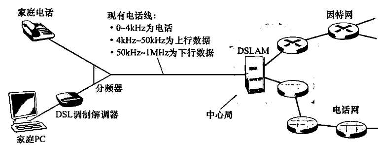
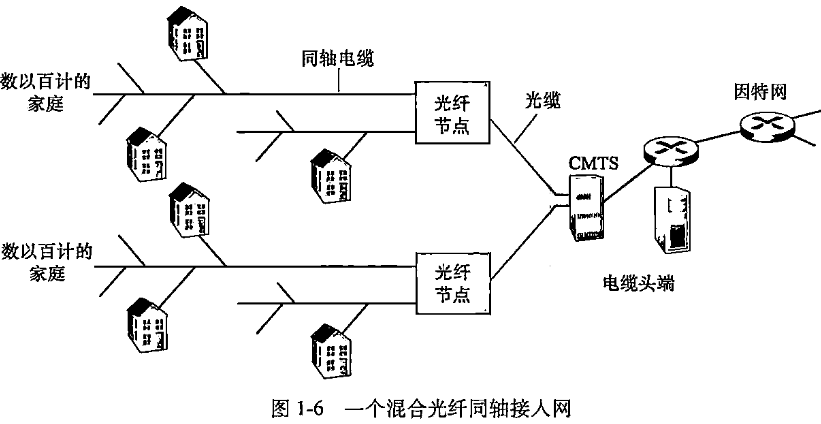
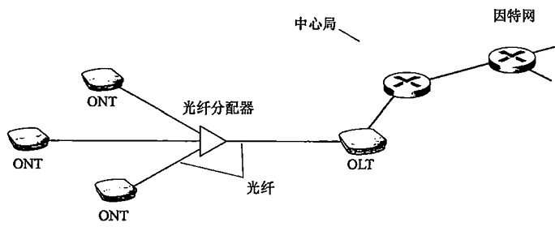
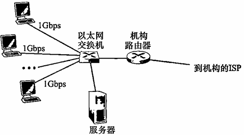
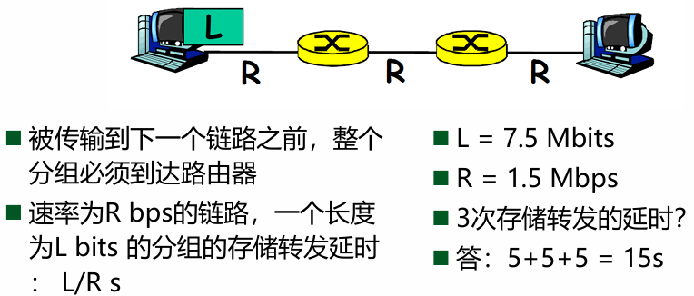
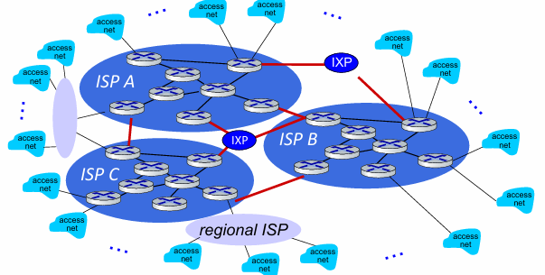
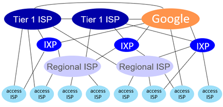
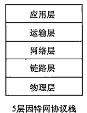
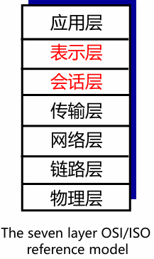

# Chapter 1：计算机网络和因特网
[TOC]
## 1.1 什么是因特网

### 1.1.1 具体构成描述（bolts and nuts view）

主机或端系统通信链路路由器协议网络的网络

#### 网络：终端设备、路由器、链路的集合，是松散的层次结构

*   互联的计算设备

    *   主机（host）= 端系统（end systems）
    *   在网络边缘运行的应用程序

*   **分组交换设备**转发分组

    *   路由器、交换机
    *   入通信链路、出通信链路

*   通信链路

    *   光纤、同轴电缆、无线电、卫星
    *   传输速率=带宽（bps：比特/秒，bit per second）

#### 网络服务提供商ISP

端系统通过互联的网络服务提供商ISP接入因特网

*   每个ISP本身就是一个由多台分组交换机和多段通信链路组成的网络
*   每个ISP网络都是独立管理，运行IP协议

#### 协议（protocol）

控制消息的发送接收

### 1.1.2 服务描述

#### 分布式应用

*   使用通信设施进行通信的分布式应用
*   web、email、游戏……

#### 编程接口

*   通信基础设施为应用提供编程接口（通信服务）

*   **套接字接口**（socket interface）

    *   将收发数据的应用与互联网连接起来
    *   为应用提供服务选择，类似于邮政服务

### 1.1.3 什么是协议

互联网上的所有通信活动都收协议制约

#### **定义**
协议定义了在两个或多个通信实体之间交换的信息格式和次序，以及在消息（报文）的发送/接受或其他事件所采取的操作

## 1.2 网络边缘

- 主机（端系统）
    
- 应用

### 1.2.1 客户机和服务器程序

客户机程序是运行在一个端系统上的程序，它发出请求，并从运行在另一个端系统上的服务器程序接收服务。

### 1.2.2 接入网
#### 家庭接入

**DSL**（数字用户线：Digital Subscriber Line）

*   住户通过本地电话公司处获得DSL因特网接入
*   本地电话公司即ISP
*   **交换数据**：每个用户的DSL调制解调器使用现有的电话线与位于电话公司的本地中心距（CO）中的数字用户线接入复用器（DSLAM）交换数据
*   通过不同的频段来区分数据和电话信号
*   数据要通过DSL调制解调器来转换成高频音
*   **不对称**：上下行速率不同
*   **缺点**：受距离、双绞线规格、电器干扰等影响速率

**电缆**

*   通过有线电视公司现有的有线电视基础设施
*   混合光纤同轴系统（HFC）：同时有光纤和电缆
*   电缆调制解调器：同DSL调制解调器，接入通常不对称，下行比上行传输速率高
*   电缆调制解调器（CMTS）：与DSLAM具有类似的功能，将模拟信号转换回数字形式
*   缺点：较低和合同数据率和媒介损耗，不能达到最大可取的速率
*   **特征**：共享广播媒体，需要一个分布式多路访问协议来协调传输和避免碰撞

**FTTH**（光纤到户：Fiber To The Home）

*   从本地中心局直接到家庭的光纤路径

*   约每秒千兆比特

*   分布方案

    *   直接光纤（最简单）：从本地中心局导每户设置一根光纤

    *   共享再分开（更一般）：从中心局出来的每根光纤实际上由许多家庭共享，直到相对接近这些家庭的位置，该光纤才分成每户一根

        *   有源光纤网络（AON，Active Optical Network）：本质上就是交换以太网

        *   无源光纤网络（PON，Passive Optical Network）光纤网络端接器（ONT）——>分配器——>光纤线路端接器（OLT）

**5G固定式无线**

*   无安装成本，不需要布线
*   采用5G固定式无线，使用波束成形级数，

#### 企业（和家庭接入）

**以太网**

*   局域网（LAN）的一种，将端系统连接到边缘路由器

**WIFI**

*   基于IEEE 802.11 技术的无线LAN接入

#### 广域接入

*   包括3G、LTE 4G和5G等等
*   应用与蜂窝移动电话相同的无线基础设施
*   通过蜂窝网提供商运营的基站来发送和接收分组
*   优点：可以距离基站数万米

### 1.2.3 物理媒介

#### 导引性媒介(guided media)

信号沿着固体媒介被导引，如同轴电缆、光纤、双绞线

**1\. 双绞铜线（Twisted Pair）**

- **结构**：两根绝缘铜导线按规则螺旋状排列，可多对捆扎成电缆并加保护层。
    
- **特点**：成本低、应用最广泛；速率与线径、传输距离相关
        

**2\. 同轴电缆（Coaxial Cable）**

- **结构**：两根同心铜导体，配合特殊绝缘层和保护层。
           
- **特点**：抗干扰能力强，支持较高数据传输速率。
    

**3\. 光纤（Fiber Optic Cable）**

- **原理**：利用光脉冲（每个脉冲代表 1 比特）在玻璃纤维中传输数据。
- **特点**：
    
    - 抗电磁干扰、信号衰减小、窃听难。
        
    - 缺点：光设备（发射器、接收器、交换机）成本高，短距传输（如家庭接入）应用受限。
        

#### 非导引性媒介(unguided media)：

开放的空间传输电磁波或者光信号,在电磁或者光信号中承载数字数据

**1\. 陆地无线电信道**

- **原理**：利用电磁频谱承载信号，穿透墙壁、支持移动连接和长距离传输。
          
- **特性**：性能依赖传播环境，受路径损耗、遮挡衰落、多径衰落和干扰影响
    

**2\. 卫星无线电信道**

- **原理**：通过地面站与卫星通信，卫星接收信号后在不同频率转发
## 1.3 网络核心
#### 定义

网络核心：互联因特网端系统的分组交换机和链路的网状网络。
### 1.3.1分组交换

#### 核心原理(分组+存储转发)

主机将应用层消息拆分为多个**分组（Packet）**，分组通过路由器逐跳传输，最终在目的端重组。路由器采用**存储 - 转发（Store-and-Forward）** 机制：必须完整接收一个分组后，才能开始向输出链路传输。

- 单分组经过 N 条速率为 R 的链路、N-1 个路由器的总时延：
    
    $$d = \frac{NL}{R}$$
    
    ​L 为分组长度
    

#### **两个核心功能**

1. **路由选择（Routing）**：全局动作，通过路由协议生成转发表，为分组确定从源到目的的路径
    
2. **转发（Forwarding）**：……数据包从路由器的输入链路移动到相应的路由器输出链路
    

#### **关键特性与问题**

1. **排队时延与分组丢失**：路由器输出链路有**输出队列（缓存）**，若链路忙，分组需排队（排队时延）；缓存空间有限时，分组会丢失（Packet Loss丢包）
    
2. **资源利用**：采用**统计复用**，多个用户共享链路资源，无需预留，适合突发式通信。

### 1.3.2电路交换

#### **核心原理**

在数据传输前，需在源和目的之间**建立专用的端到端连接**，为连接预留固定的链路资源（带宽、时隙等），传输期间资源**独占**，传输结束后释放连接

#### **资源复用方式**

1. **频分复用（FDM）**：链路的频谱由跨越链路创建的所有连接共享，每个连接分配一个专属频段。
    
2. **时分复用（TDM）**：时间被划分为固定时段的帧，帧再被划分为固定数量的时隙，传输时，网络在每个帧中为该连接指定一个专有的时隙用于传输
    
    - 计算示例：链路速率 1.536Mbps，TDM 分为 24 个时隙 → 每个时隙速率 = 64kbps；传输 640,000 比特数据的传输时间 = 10s，加上 0.5s 连接建立时间，总时长 10.5s
        

#### **关键特性**

1. **优势**：资源独占，传输性能有保障（无排队时延），适合实时性要求高的通信（如传统电话网络）。
    
2. **劣势**：连接建立时延长；资源利用率低（无数据传输时，预留资源闲置）；不适合计算机之间的突发式通信

#### 电路交换与分组交换的对比
  1. 分组交换的端到端时延是变动和不可预测的，故不适合实时服务；
  2. 分组交换提供了比电路交换更好的带宽共享；
  3. 分组交换比电路交换更简单、有效，实现成本更低；
  4. 总的来说，分组交换的性能能够优于电路交换。

- **统计多路复用（statistical multiplexing）**：按需（而不是预分配）共享资源被称为资源的统计多路复用。

#### 1.3.3网络的网络（因特网的结构） 
- 端系统通过网络服务提供商(ISP)连接到互联网
- ISP之间必须进行互联：任何两台主机都可以互相发送数据包
- 由此产生的网络嵌套非常复杂（网络的网络） ，且**受经济和国家政策驱动**影响而演化（不是性能驱动）
    
#### **网络层级结构**

- **网络结构1**：用单一的全球传输ISP互联所有接入ISP
- **网络结构2**：由数十万接入ISP和多个全球传输ISP组成（全球ISP有利可图，显然会有其他公司加入并竞争）
- **网络结构3**：第一层ISP（tier-1 ISP，类似于假想的全球传输ISP）——>区域ISP（regional ISP）——>接入ISP
    - 接入ISP也可以直接连接第一层
    - 这个多层等级结构仍然只与今天的因特网粗略近似
        
- **网络结构4**：由接入ISP、区域ISP、第一层ISP、PoP、多宿、对等和IXP组成
    
    - PoP：存在点（Point of Presence），存在于除底层外的的层次，是提供商网络中的一台或多台路由器群组，客户ISP能够与提供商ISP项链
        
    - **多宿**：multi-home，除第一层外的ISP都可以选择多宿，即可以与两个或多个提供商ISP连接，提高稳定性和冗余
        
    - **对等**：位于相同等级结构层次的临近的一对ISP能够对等（直接互传，无需上层，也无需付费结算）
        
    - **IXP**：因特网交换点（Internet Exchange Point），一个汇合点，多个ISP能够在这里一起对等，通常有自己的交换机群
    
	

    
- **网络结构5**：如今的因特网，由网络结构4+内容提供商网络组成
    
    - Content provider networks (e.g., Google, Meta): 私有网络将自己的数据中心 接入ISP，方便周边用户的访问；通常私有网络之间用专网绕过第一层ISP和区域性网络

	

## 1.4 分组交换网中的时延、丢包和吞吐量

### 1.4.1 分组交换网中的时延概述

#### 处理时延（nodal processing）
检查分组首部和决定该分组导向何处，检查比特差错所需的时间。
#### 排队时延（queuing）
分组在链路上等待传输的时延
取决于先期到达的、正在排队等待向链路传输的分组的数量。
#### 传输时延（transmission）
将所有分组的比特推（传输）向链路所需要的时间
仅当所有已经到达的分组被传输后，才能传输刚到达的分组
#### 传播时延（propagation）
从链路的起点到下一个路由器传播所需要的时间。

#### 传输和传播时延

- 传输：路由器的处理时间
    
- 传播：链路输送的时间
### 1.4.2 排队时延和丢包
#### **排队时延**

- 用统计量来度量，如平均、方差etc.
    
- 什么时候大/不大，**取决于**：
    
    - 流量到达该队列的速率
        
    - 链路的传输速率
        
    - 到达流量的性质（突发/周期性）
- a：分组到达队列的平均速率（组/秒，pkt/s）
    
- L：分组长度 (bits)
    
- R：链路带宽(bit transmission rate)，即传输速率（bps）
    
- **流量强度**：衡量网络队列拥塞程度的关键指标
    
    $$ρ=\frac{La}{R}$$
    
    - La：表示比特到达速率（arrival rate of bits）分组平均长度 L 乘以分组到达速率 a，得到每秒到达队列的总比特数
        
    - **比值越大，排队越严重**
#### 丢包
到达分组发现满队列时将被丢弃。（丢失分组的数量随着流量强度的增加而增加）

### 1.4.3 端到端时延
**假设**

- 在源主机和目的主机之间有 $N-1$台路由器
    
- 该网络此时是无拥塞的（因此排队时延是微不足道的）
    
    - 在每台路由器和源主机上的处理时延是 $d_{proc}$
        
    - 每台路由器和源主机的输出速率是 $R$ bps
        
    - 每条链路的传播时延是 $d_{\text{prop}}$
        

节点时延累加起来，得到端到端时延：

$$d_{end-end} = N(d_{proc} + d_{trans} + d_{prop})$$

其中：

- $d_{\text{trans}} =\frac{L}{R}$
    

- $L$ 是分组长度
    

端到端是单节点时延的一般形式，单节点 没有考虑处理时延和传播时延。在各节点具有不同的时延和每个节点存在平均排队时延的情况下，需要对端到端进行一般化处理

### 1.4.4计算机网络中的吞吐量(Throughput)

**瞬时吞吐量**：主机B接收到该文件的速率（以bps记）

**平均吞吐量**：在一个时间段的平均值

- 文件由$F$bit组成
    
- 主机B接受到所有$F$bit用了$T$s
    
- 平均吞吐量=$\frac{F}{T}$
    

#### **简单链路的计算**

想象成水管和流体，服务器A以$R_s$速率注入bit，路由器以$R_c$速率转发bit

- $R_s<R_c$，则注入的bit按照$R_s$速率通过路由器并以$R_s$到达B
    
- $R_s>R_c$，则注入的bit将在路由器等待并积压，以$R_c$到达B
    

**吞吐量**：$min\{R_s,R_c\}$

**瓶颈链路**：端到端路径上，限制端到端吞吐的链路

**注意**：

- 实际中，瓶颈链路通常是接入网，也就是$R_s$或$R_c$
    
- 当有其他干扰流量时，吞吐量不仅取决于沿路的传输速率，也取决于干扰流量

## 1.5 协议层次和它们的服务模型

### 1.5.1 分层的体系结构
#### **服务和协议**
- 区别
    
    - 服务(Service) 是垂直的
        
        - 低层实体向上层实体提供它们之间的通信的能力
            
    - 协议(protocol) 是水平的
        
        - 对等层实体(peer entity)之间在相互通信的过程中，需要 遵循的规则的集合
            
- 联系
    
    - 本层协议要靠下层提供的服务来实现
        
    - 本层实体通过协议为上层提供更高级的服务

#### 分层的原则：
1. 可以讨论一个定义良好且大而复杂的系统的特定部分；
2. 模块化使得维护和提升更加容易。

#### 分层的潜在缺点：
1. 某层可能重复较低层的功能；
2. 某层的功能可能需要仅在其他某层才出现的信息。

各层的所有协议称为协议栈。

#### 因特网的协议栈组成（自顶向下方法）：
1. 应用层；
2. 运输层：提供在应用程序端点之间传送应用层报文的服务；
3. 网络层：决定数据报从源到目的地的路径,将网络层分组从一台主机移动到另一台主机；
4. 链路层：为了将分组从一个节点（主机或路由器）移动到路径上的下一个节点，网络层必须依靠链路层的服务；
5. 物理层：将帧中的每个比特从一个节点移动到下一个节点。

#### ISO模型
国际标准化组织（ISO）提出开放系统互联模型（OSI），将计算机网络组织分为7层。
- 表示层（presentation）：使通信的应用程序能够解释交换数据的含义，提供的服务包括数据压缩、数据解密、数据描述；
- 会话层（session）：提供数据交换的定界和同步功能，包括建立检查点和恢复方案的方法。
#### **因特网协议栈**

**Application 应用层: 为应用进程提供服务**

*   **核心功能：** 网络应用程序及其协议存放的地方。协议分布式运行在多个端系统上，通过交换分组来交互。

*   **数据单位：** 报文 (Message)

*   典型协议：

    *   HTTP: Web 文档请求与传送。
    *   SMTP: 电子邮件报文传输。
    *   FTP: 端系统之间的文件传送。
    *   DNS: 域名解析服务（将域名转换为 32 比特网络地址）。

**Transport 传输层: 进程-进程之间数据传输**

*   **核心功能：** 在应用程序端点之间传送应用层报文。

*   **数据单位：** 报文段 (Segment)

*   主要协议：

    *   **TCP**: 面向连接的服务。提供可靠传递、流量控制（匹配发送/接收速率）和拥塞控制。
    *   **UDP**: 无连接服务。提供不可靠传输，没有流量控制和拥塞控制。

**Network 网络层: 主机-主机之间传输**

*   **核心功能：** 负责将分组从一台主机移动到另一台主机。包含路由选择协议，决定数据报从源到目的地的路径。

*   **数据单位：** 数据报 (Datagram)

*   核心组件：

    *   **IP 协议**： 定义了数据报中的字段以及端系统/路由器如何作用于这些字段。它是因特网的“黏合剂”。
    *   路由协议 (Routing Protocols): 如 OSPF、BGP，用于决定路径。

**Link 链路层: 点到点（相邻两点）之间传输**

*   **核心功能：** 将整个帧从一个网络元素移动到邻近的网络元素。网络层必须依靠链路层提供的服务。

*   **数据单位：** 帧 (Frame)

*   典型协议：

    *   Ethernet (以太网)、WiFi (802.11)、PPP、DOCSIS。

*   **特性：** 一个数据报在传输路径上可能会被不同的链路层协议处理（例如先经过以太网，再经过 PPP）。

**Physical 物理层: bits "on the wire"**

*   **核心功能：** 将帧中的每一个**比特 (Bit)** 从一个节点移动到下一个节点。
*   **传输媒介：** 与实际传输媒介相关，如双绞线、单模光纤、同轴电缆等。

#### ISO/OSI 参考模型对比 (补充)

*   **OSI 七层模型：** 在应用层和传输层之间多了 表示层 (Presentation) 和 会话层 (Session)。

    *   **表示层：** 处理数据解释（加密、压缩、格式转换）。
    *   **会话层：** 处理数据交换的同步、检查点和恢复。

*   **因特网协议栈的权衡：** 因特网协议栈没有这两层。如果应用需要这些服务，必须由应用程序开发者在应用层中实现

### 1.5.2封装

#### **封装**

每一层的分组通常包含两个部分

- 首部字段+有效载荷字段
    
    - 有效载荷字段通常来自上一层的分组封装
        
    - 如应用层报文和运输层首部信息构成运输层报文段
        

#### **分层处理和实现复杂系统的好处**

对于复杂的系统:

- 概念化：结构清晰，便于标识网络组件，以及描述其相互关系
    
    - 分层参考模型
        
- 结构化：模块化更易于维护和系统升级
    
- 改变某一层服务的实现不影响系统中的其他层次:
        
    - 对于其他层次而言是透明的
            
	- 举例：改变登机程序并不影响系统的其它部分
            

#### **分层思想的坏处**：

- 开销更大
    
- 效率更低
    
- 更复杂
    
- 不够灵活

## 1.6 攻击威胁下的网络

- 病毒（virus）：需要某种形式的用户交互来感染用户设备的恶意软件。
- 蠕虫（worm）：无需任何明显用户交互就能进入用户设备的恶意软件。
- 特洛伊木马（Trojan horse）：隐藏在有用软件中的恶意软件。

#### 举例
- 恶意软件和僵尸网络
- 拒绝服务DoS：使……基础设施部分或全部不能由合法用户使用
   - 弱点攻击：向目标主机易受攻击的应用程序或操作系统发送制作精细的报文；
   - 带宽洪泛：向目的主机发送大量的分组，导致目标的接入链路变得拥塞，使合法分组无法到达服务器
		- 若服务器接入速率为$R$ bps，攻击者需以约 $R$ bps 的速率产生危害；单一源通常无法满足，因此衍生 DDoS
   - 连接洪泛：在目标主机中创建大量的半开或全开TCP连接，目标主机因伪造的连接而陷入困境，停止合法的连接
- DDoS分布式DoS：分布式拒绝服务攻击，攻击者控制多个源，让每个源向目标猛烈发送流量。
- 嗅探分组：记录每个流经的分组拷贝的被动接收机，仅在广播型网络有效
- IP哄骗（IP spoofing）：将具有虚假原地址的分组注入因特网的能力
	- 采用端点鉴别机制，确保报文源自正确的地方。
- 中间人攻击：攻击者插入到通信双方之间，劫持并转发双方的通信流量

## 1.7 计算机网络和因特网的历史