# 第1章：计算机网络和因特网
[TOC]
## 1.1什么是因特网

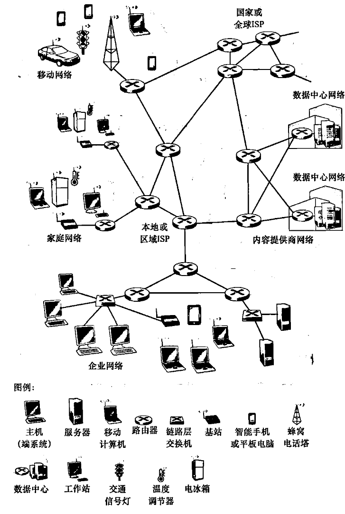

**节点**

*   终端节点：主机及其运行的应用程序
*   中间节点：路由器（圆形上有×）、交换机（方形上有×）

**边：通信线路**

*   接入网链路：
*   主干链路：

### 1.1.1从具体构成角度

#### 网络：终端设备、路由器、链路的集合，是松散的层次结构

*   互联的计算设备

    *   主机（host）= 端系统（end systems）
    *   在网络边缘运行的应用程序

*   **分组交换设备**转发分组

    *   路由器、交换机
    *   入通信链路、出通信链路

*   通信链路

    *   光纤、同轴电缆、无线电、卫星
    *   传输速率=带宽（bps：比特/秒，bit per second）

#### 网络服务提供商ISP

端系统通过互联的网络服务提供商ISP接入因特网

*   每个ISP本身就是一个由多台分组交换机和多段通信链路组成的网络
*   每个ISP网络都是独立管理，运行IP协议

#### 协议（protocol）

控制消息的发送接收

**标准**

IETF：Internet Engineering Task Force

**RFC：request for comments 请求评述**

### 1.1.2从服务角度

#### 分布式应用

*   使用通信设施进行通信的分布式应用
*   web、email、游戏……

#### 编程接口

*   通信基础设施为应用提供编程接口（通信服务）

*   **套接字接口**（socket interface）

    *   将收发数据的应用与互联网连接起来
    *   为应用提供服务选择，类似于邮政服务

### 1.1.3协议

互联网上的所有通信活动都收协议制约

**定义**：协议定义了在两个或多个通信实体之间交换的信息格式和次序，以及在消息（报文）的发送/接受或其他事件所采取的操作

## 1.2网络边缘

*   主机（端系统）
*   应用

### 1.2.1接入网

#### 家庭接入

**DSL**（数字用户线：Digital Subscriber Line）

*   住户通过本地电话公司处获得DSL因特网接入
*   本地电话公司即ISP
*   交换数据：每个用户的DSL调制解调器使用现有的电话线与位于电话公司的本地中心距（CO）中的数字用户线接入复用器（DSLAM）交换数据
*   通过不同的频段来区分数据和电话信号
*   数据要通过DSL调制解调器来转换成高频音
*   不对称：上下行速率不同
*   缺点：受距离、双绞线规格、电器干扰等影响速率

**电缆**

*   通过有线电视公司现有的有线电视基础设施
*   混合光纤同轴系统（HFC）：同时有光纤和电缆
*   电缆调制解调器：同DSL调制解调器，接入通常不对称，下行比上行传输速率高
*   电缆调制解调器（CMTS）：与DSLAM具有类似的功能，将模拟信号转换回数字形式
*   缺点：较低和合同数据率和媒介损耗，不能达到最大可取的速率
*   **特征**：共享广播媒体，需要一个分布式多路访问协议来协调传输和避免碰撞

**FTTH**（光纤到户：Fiber To The Home）

*   从本地中心局直接到家庭的光纤路径

*   约每秒千兆比特

*   分布方案

    *   直接光纤（最简单）：从本地中心局导每户设置一根光纤

    *   共享再分开（更一般）：从中心局出来的每根光纤实际上由许多家庭共享，直到相对接近这些家庭的位置，该光纤才分成每户一根

        *   有源光纤网络（AON，Active Optical Network）：本质上就是交换以太网

        *   无源光纤网络（PON，Passive Optical Network）光纤网络端接器（ONT）——>分配器——>光纤线路端接器（OLT）

**5G固定式无线**

*   无安装成本，不需要布线
*   采用5G固定式无线，使用波束成形级数，

#### 企业（和家庭接入）

**以太网**

*   局域网（LAN）的一种，将端系统连接到边缘路由器

**WIFI**

*   基于IEEE 802.11 技术的无线LAN接入

#### 广域接入

*   包括3G、LTE 4G和5G等等
*   应用与蜂窝移动电话相同的无线基础设施
*   通过蜂窝网提供商运营的基站来发送和接收分组
*   优点：可以距离基站数万米

### 1.2.2物理媒介

**单位**：比特(bit)，在发送-接收对间传播

**physical link(物理链路)**：连接每个发送-接收对之间的物理媒体

#### **导引性媒介**(guided media)

信号沿着固体媒介被导引，如同轴电缆、光纤、双绞线

**1. 双绞铜线（Twisted Pair）**

*   **结构**：两根绝缘铜导线按规则螺旋状排列，可多对捆扎成电缆并加保护层。

*   **分类**：

    *   无屏蔽双绞线（UTP）：常用于局域网（LAN）即建筑内的计算机网络

*   **速率与应用**：

    *   传统：电话网、早期局域网（10Mbps）。

    *   现代：6a 类电缆可达 **10Gbps**，传输距离 100m，成为高速 LAN 主导方案。

    *   住宅接入：DSL 技术可提供超 Mbps 级速率，早期拨号调制解调器为 56kbps。

    *   **特点**：成本低、应用最广泛；速率与线径、传输距离相关

**2. 同轴电缆（Coaxial Cable）**

*   **结构**：两根同心铜导体，配合特殊绝缘层和保护层。

*   **应用**：

    *   有线电视系统：结合电缆调制解调器，为住宅提供数百 Mbps 级因特网接入。
    *   共享媒介：多端系统可直接连接，共享带宽（导引型共享媒介）
    *   高速LAN联网的解决方案

*   **特点**：抗干扰能力强，支持较高数据传输速率。

**3. 光纤（Fiber Optic Cable）**

*   **原理**：利用光脉冲（每个脉冲代表 1 比特）在玻璃纤维中传输数据。

*   **速率与应用**：

    *   速率极高：可达数十至数百 Gbps，OC 标准链路速率范围为 51.8Mbps~39.8Gbps（OC-n，n×51.8Mbps）。
    *   长途骨干：因特网主干、跨洋链路、长途电话网络。

*   **特点**：

    *   抗电磁干扰、信号衰减小、窃听难。
    *   缺点：光设备（发射器、接收器、交换机）成本高，短距传输（如家庭接入）应用受限。

#### **非导引性媒介**(unguided media)：

开放的空间传输电磁波或者光信号,在电磁或者光信号中承载数字数据

**1. 陆地无线电信道**

*   **原理**：利用电磁频谱承载信号，穿透墙壁、支持移动连接和长距离传输。

*   **分类**：

    *   短距（如 1~2m）：无线耳机、键盘、医疗设备。
    *   局域（数十至几百米）：无线 LAN（WiFi，速率 10~100+Mbps）。
    *   广域（数万米）：蜂窝接入（4G/5G，速率 10+Mbps，覆盖～10km）、地面微波（点到点，45Mbps 信道）。

*   **特性**：性能依赖传播环境，受路径损耗、遮挡衰落、多径衰落和干扰影响

**2. 卫星无线电信道**

*   **原理**：通过地面站与卫星通信，卫星接收信号后在不同频率转发

*   **分类**：

    *   **同步卫星（GEO）**：位于地球 36000km 轨道，相对地面静止；时延约 280ms，用于无法使用 DSL / 电缆的区域
    *   **近地轨道卫星（LEO）**：如 Starlink 星链，距地球近、非静止，需多星组网实现连续覆盖；未来可用于因特网接入

*   **速率**：单信道 Kbps\~45Mbps，或多个聚集信道

## 1.3网络核心

**定义：**由互联路由器的网状结构构成（端系统的分组交换机和链路），核心功能是实现数据在源和目的端系统之间的传输，核心技术为**分组交换**和**电路交换**

### 1.3.1分组交换

#### **核心原理**

主机将应用层消息拆分为多个**分组（Packet）**，分组通过路由器逐跳传输，最终在目的端重组。路由器采用**存储 - 转发（Store-and-Forward）** 机制：必须完整接收一个分组后，才能开始向输出链路传输。

*   单分组经过 N 条速率为 R 的链路、N-1 个路由器的总时延：

    $$
    d = \frac{NL}{R}
    $$

    ​L 为分组长度

#### **两个核心功能**

1.  **路由选择（Routing）**：全局动作，通过路由协议生成转发表，为分组确定从源到目的的**路径**。
2.  **转发（Forwarding）**：本地动作，路由器检查分组的目的 IP 地址，查询转发表，将到达的数据包从路由器的输入链路移动到相应的路由器输出链路”

#### **关键特性与问题**

1.  **排队时延与分组丢失**：路由器输出链路有**输出队列（缓存）**，若链路忙，分组需排队（排队时延）；缓存空间有限时，分组会丢失（Packet Loss丢包）
2.  **资源利用**：采用**统计复用**，多个用户共享链路资源，无需预留，适合突发式通信。

### 1.3.2电路交换

#### **核心原理**

在数据传输前，需在源和目的之间**建立专用的端到端连接**，为连接预留固定的链路资源（带宽、时隙等），传输期间资源**独占**，传输结束后释放连接

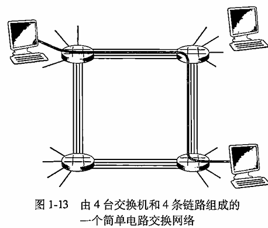

#### **资源复用方式**

1.  **频分复用（FDM）**：链路的频谱由跨越链路创建的所有连接共享，每个连接分配一个专属频段。

2.  **时分复用（TDM）**：时间被划分为固定时段的帧，帧再被划分为固定数量的时隙，传输时，网络在每个帧中为该连接指定一个专有的时隙用于传输

    *   计算示例：链路速率 1.536Mbps，TDM 分为 24 个时隙 → 每个时隙速率 = 64kbps；传输 640,000 比特数据的传输时间 = 10s，加上 0.5s 连接建立时间，总时长 10.5s

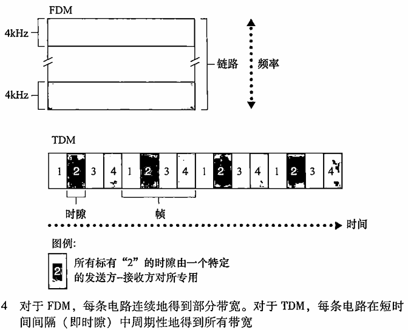

#### **关键特性**

1.  **优势**：资源独占，传输性能有保障（无排队时延），适合实时性要求高的通信（如传统电话网络）。
2.  **劣势**：连接建立时延长；资源利用率低（无数据传输时，预留资源闲置）；不适合计算机之间的突发式通信

### 1.3.3网络的网络（因特网的结构）

*   internet（小写）= 通用概念，泛指互联的网络
*   Internet（大写）= 专有名词，特指那个全球性 的公共网络
*   端系统通过网络服务提供商(ISP)连接到互联网
*   ISP之间必须进行互联：任何两台主机都可以互相发送数据包
*   由此产生的网络嵌套非常复杂（网络的网络） ，且**受经济和国家政策驱动**影响而演化（不是性能驱动）

#### **网络层级结构**

*   **网络结构1**：用单一的全球传输ISP互联所有接入ISP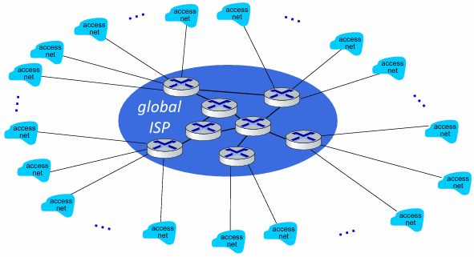

*   **网络结构2**：由数十万接入ISP和多个全球传输ISP组成（全球ISP有利可图，显然会有其他公司加入并竞争）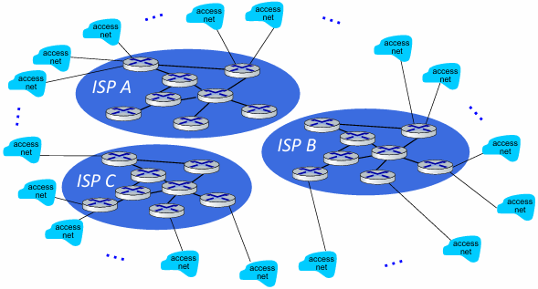

*   **网络结构3**：第一层ISP（tier-1 ISP，类似于假想的全球传输ISP）——>区域ISP（regional ISP）——>接入ISP

    *   接入ISP也可以直接连接第一层
    *   这个多层等级结构仍然只与今天的因特网粗略近似

*   **网络结构4**：由接入ISP、区域ISP、第一层ISP、PoP、多宿、对等和IXP组成

    *   PoP：存在点（Point of Presence），存在于除底层外的的层次，是提供商网络中的一台或多台路由器群组，客户ISP能够与提供商ISP项链
    *   多宿：multi-home，除第一层外的ISP都可以选择多宿，即可以与两个或多个提供商ISP连接，提高稳定性和冗余
    *   对等：位于相同等级结构层次的临近的一对ISP能够对等（直接互传，无需上层，也无需付费结算）
    *   IXP：因特网交换点（Internet Exchange Point），一个汇合点，多个ISP能够在这里一起对等，通常有自己的交换机群

    

*   **网络结构5**：如今的因特网，由网络结构4+内容提供商网络组成

    *   Content provider networks (e.g., Google, Meta): 私有网络将自己的数据中心 接入ISP，方便周边用户的访问；通常私有网络之间用专网绕过第一层ISP和区域性网络

    

## 1.4分组交换网中的时延、丢包和吞吐量  

### 1.4.1分组交换网中的时延

#### **类型**

*   处理时延（$d_{proc}$）

    *   检查bit级差错
    *   检查分组首部和决定将分组导向何处
    *   通常< 微秒 microsecs

*   排队时延（$d_{queue}$）

    *   在输出链路上等待传输的时间
    *   依赖于路由器的拥塞程度
    *   微秒—毫秒级

*   传输时延（$d_{trans}$）

    *   将所有分组的比特推向链路（传输）所需要的时间（仅当所有已经到达的分组被传输后，才能传输刚到达的分组）
    *   微秒—毫秒级
    *   L：分组长度(bits)
    *   R：链路带宽 (bps)
    *   $d_{trans}=\frac{L}{R}$

*   传播时延（$d_{prop}$）

    *   在链路中传播的时间，传播速率取决于链路的物理媒介

    *   在广域网中为毫秒级

    *   d：物理链路的长度

    *   s：在媒体上的传播速度（ $2 \times 10^8$ \~ $3 \times 10^8$  m/s）

    *   $d_{prop}=\frac{d}{s}$

#### **传输和传播时延**

*   传输：路由器的处理时间
*   传播：链路输送的时间

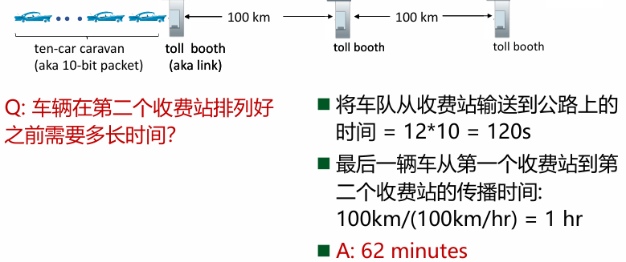

#### **节点的总时延**

$d_{nodal}=d_{proc}+d_{queue}+d_{trans}+d_{prop}$

*   $d_{proc}$ ：对一台路由器的最大吞吐量有重要影响，即能够转发分组的最大速率

*   $d_{trans}$ ：对低速率的链路而言很大，通常为微秒到几百毫秒

*   $d_{prop}$ ：取决于距离

### 1.4.2排队时延和丢包

#### **排队时延**

*   用统计量来度量，如平均、方差etc.

*   什么时候大/不大，取决于：

    *   流量到达该队列的速率
    *   链路的传输速率
    *   到达流量的性质（突发/周期性）

*   a：分组到达队列的平均速率（组/秒，pkt/s）

*   L：分组长度 (bits)

*   R：链路带宽(bit transmission rate)，即传输速率（bps）

*   **流量强度**：衡量网络队列拥塞程度的关键指标

    $$
    ρ=\frac{La}{R}
    $$

    *   La：表示比特到达速率（arrival rate of bits）分组平均长度 L 乘以分组到达速率 a，得到每秒到达队列的总比特数

    *   比值越大，排队越严重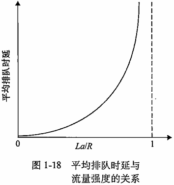

#### **丢包**

*   链路的队列缓冲区容量有限，路由器将丢弃分组
*   当分组到达一个满的队列时，该分组将会丢失
*   丢失的分组可能会被前一个节点或源端系统重传，或根本不重传
*   一个节点的性能不仅根据时延，还根据丢包的概率

### 1.4.3端到端时延

**假设**

*   在源主机和目的主机之间有  $N-1$ 台路由器

*   该网络此时是无拥塞的（因此排队时延是微不足道的）

    *   在每台路由器和源主机上的处理时延是  $d_{proc}$

    *   每台路由器和源主机的输出速率是 \$R\$ bps

    *   每条链路的传播时延是  $d_{\text{prop}}$

节点时延累加起来，得到端到端时延：

$$
d_{end-end} = N(d_{proc} + d_{trans} + d_{prop})
$$

其中：

*   $d_{\text{trans}} =\frac{L}{R}$

<!---->

*   $L$  是分组长度

端到端是单节点时延的一般形式，单节点 没有考虑处理时延和传播时延。在各节点具有不同的时延和每个节点存在平均排队时延的情况下，需要对端到端进行一般化处理

### 1.4.4计算机网络中的吞吐量(Throughput)

**瞬时吞吐量**：主机B接收到该文件的速率（以bps记）

**平均吞吐量**：在一个时间段的平均值

*   文件由 $F$ bit组成

*   主机B接受到所有 $F$ bit用了 $T$ s

*   平均吞吐量= $\frac{F}{T}$

#### **简单链路的计算**

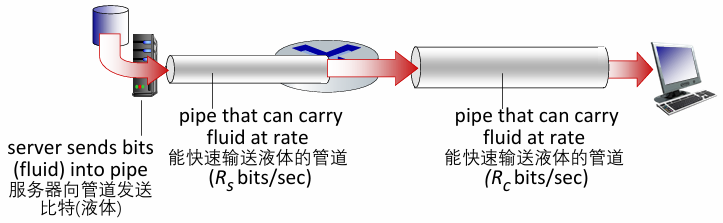

想象成水管和流体，服务器A以$R_s$速率注入bit，路由器以$R_c$速率转发bit

*   $R_s<R_c$ ，则注入的bit按照 $R_s$ 速率通过路由器并以 $R_s$ 到达B

*   $R_s>R_c$ ，则注入的bit将在路由器等待并积压，以 $R_c$ 到达B

**吞吐量**：$min\{R_s,R_c\}$

**瓶颈链路**：端到端路径上，限制端到端吞吐的链路

**注意**：

*   实际中，瓶颈链路通常是接入网，也就是 $R_s$ 或 $R_c$

*   当有其他干扰流量时，吞吐量不仅取决于沿路的传输速率，也取决于干扰流量

## 1.5协议层次及其服务模型

### 1.5.1分层的体系结构

#### **服务分层**

*   通过自身的内层动作实现服务
*   所实现的服务依赖于下层提供的服务
*   改变服务的实现不影响该系统其他组件的分层

#### **协议分层**

*   将网络复杂的功能分成明确的层次，每一层实现了其中一个或 一组功能，这些功能可以为上层提供服务
*   本层协议实体相互交互，执行本层的协议动作，目的是实现本 层功能，然后通过接口为上层提供的服务
*   在实现本层协议的时候，直接利用了下层所提供的服务

#### **服务和协议**

*   区别

    *   服务(Service) 是垂直的

        *   低层实体向上层实体提供它们之间的通信的能力

    *   协议(protocol) 是水平的

        *   对等层实体(peer entity)之间在相互通信的过程中，需要 遵循的规则的集合

*   联系

    *   本层协议要靠下层提供的服务来实现
    *   本层实体通过协议为上层提供更高级的服务

#### **因特网协议栈**

**Application 应用层: 为应用进程提供服务**

*   **核心功能：** 网络应用程序及其协议存放的地方。协议分布式运行在多个端系统上，通过交换分组来交互。

*   **数据单位：** 报文 (Message)

*   典型协议：

    *   HTTP: Web 文档请求与传送。
    *   SMTP: 电子邮件报文传输。
    *   FTP: 端系统之间的文件传送。
    *   DNS: 域名解析服务（将域名转换为 32 比特网络地址）。

**Transport 传输层: 进程-进程之间数据传输**

*   **核心功能：** 在应用程序端点之间传送应用层报文。

*   **数据单位：** 报文段 (Segment)

*   主要协议：

    *   **TCP**: 面向连接的服务。提供可靠传递、流量控制（匹配发送/接收速率）和拥塞控制。
    *   **UDP**: 无连接服务。提供不可靠传输，没有流量控制和拥塞控制。

**Network 网络层: 主机-主机之间传输**

*   **核心功能：** 负责将分组从一台主机移动到另一台主机。包含路由选择协议，决定数据报从源到目的地的路径。

*   **数据单位：** 数据报 (Datagram)

*   核心组件：

    *   **IP 协议**： 定义了数据报中的字段以及端系统/路由器如何作用于这些字段。它是因特网的“黏合剂”。
    *   路由协议 (Routing Protocols): 如 OSPF、BGP，用于决定路径。

**Link 链路层: 点到点（相邻两点）之间传输**

*   **核心功能：** 将整个帧从一个网络元素移动到邻近的网络元素。网络层必须依靠链路层提供的服务。

*   **数据单位：** 帧 (Frame)

*   典型协议：

    *   Ethernet (以太网)、WiFi (802.11)、PPP、DOCSIS。

*   **特性：** 一个数据报在传输路径上可能会被不同的链路层协议处理（例如先经过以太网，再经过 PPP）。

**Physical 物理层: bits "on the wire"**

*   **核心功能：** 将帧中的每一个**比特 (Bit)** 从一个节点移动到下一个节点。
*   **传输媒介：** 与实际传输媒介相关，如双绞线、单模光纤、同轴电缆等。

**ISO/OSI 参考模型对比 (补充)**

*   **OSI 七层模型：** 在应用层和传输层之间多了 表示层 (Presentation) 和 会话层 (Session)。

    *   **表示层：** 处理数据解释（加密、压缩、格式转换）。
    *   **会话层：** 处理数据交换的同步、检查点和恢复。

*   **因特网协议栈的权衡：** 因特网协议栈没有这两层。如果应用需要这些服务，必须由应用程序开发者在应用层中实现

### 1.5.2封装

#### **封装**

每一层的分组通常包含两个部分

*   首部字段+有效载荷字段

    *   有效载荷字段通常来自上一层的分组封装
    *   如应用层报文和运输层首部信息构成运输层报文段

#### **分层处理和实现复杂系统的好处**

对于复杂的系统:

*   概念化：结构清晰，便于标识网络组件，以及描述其相互关系

    *   分层参考模型

*   结构化：模块化更易于维护和系统升级

*   *   改变某一层服务的实现不影响系统中的其他层次:
    *   *   对于其他层次而言是透明的
        *   举例：改变登机程序并不影响系统的其它部分

#### **分层思想的坏处**：

*   开销更大
*   效率更低
*   更复杂
*   不够灵活

## 1.6安全

*   一开始没有威胁模型：一群相互信任的用户依附在一个透明的网络上
*   Internet结构的每一层都需考虑安全性

### 1.6.1常见攻击行为

#### 恶意软件和僵尸网络

**恶意软件**：可进入并感染设备的恶意程序，是各类网络威胁的统称

*   删除用户文件
*   安装间谍软件，收集隐私信息
*   将收集到的隐私信息通过因特网发送给攻击者
*   使受害主机成为僵尸网络（botnet）的一员
*   **自我复制**：感染后通过因特网感染扩散

**僵尸网络**：由数以千计的受害设备组成的网络，这些设备均被恶意软件感染并受控于攻击者

#### 数据包拦截——数据包嗅探

**媒介**：仅在广播型网络中有效

*   共享式以太网（Shared Ethernet）：共享广播域
*   无线网（Wireless）：Wi-Fi 环境下，无线信号天然广播

**攻击行为**：读取/记录网络接口所有通过的数据包，包括未加密的敏感数据

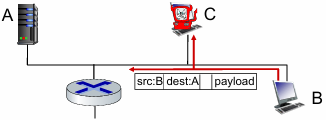

#### IP哄骗（身份伪造）

**概念**：是一种身份伪造攻击手段，攻击者通过篡改 IP 数据包的源 IP 地址，伪装成其他合法主机，向目标主机发送恶意报文

**原理**：

*   源地址由发送方自主设置，网络层默认信任发送方填写的源地址，未对其真实性进行验证
*   主机 A 收到报文后，仅校验数据包完整性，未验证源地址真实性，误以为报文来自 B

**解决方法（端点鉴别）**：使我们能够确信一个报文源自我们认为它应当来自的地方的机制

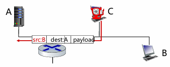

#### 中间人攻击

**本质**：攻击者插入到通信双方（用户 ↔ 服务器 / 网站）之间，劫持并转发双方的通信流量。

**效果**：通信双方误以为还在直接对话，但所有消息都经过攻击者的监听、篡改甚至伪造

#### 拒绝服务DoS（denial of service）

**定义**：使网络、主机或其他基础设施部分或全部不能由合法用户使用

**本质**：通过虚假流量压倒资源，使合法流量无法访问资源（服务器、带宽）

**攻击目标**：Web 服务器、电子邮件服务器、DNS 服务器、机构网络等均可成为目标

**主要类型**

*   **弱点攻击**

    *   向目标主机上运行的易受攻击的应用程序或操作系统发送制作精细的报文
    *   若将适当顺序的多个分组发送给脆弱的应用 / OS，可能导致服务器停止运行，甚至主机崩溃

*   **带宽泛洪**

    *   攻击者向目标主机发送大量分组，使目标接入链路拥塞，合法分组无法到达服务器

    *   若服务器接入速率为 $R$  bps，攻击者需以约  $R$  bps 的速率产生危害；单一源通常无法满足，因此衍生 DDoS

*   **连接泛洪**

    *   攻击者在目标主机中创建大量半开或全开 TCP 连接
    *   主机因这些伪造连接陷入困境，停止接受合法连接

#### DDoS分布式DoS（Distributed DoS）

**原因**

*   带宽泛洪需要的流量可能无法由单一攻击源满足
*   如果单一源发出所有流量的话，上游路由器可以拦截

**定义**：分布式拒绝服务攻击，攻击者控制多个源（受控站点 / 僵尸网络），让每个源向目标猛烈发送流量。

**伪装目标**：看起来像一个随机的互联网用户

**特点**：聚合所有受控源的流量速率，使其约等于目标接入速率 $R$ bps，使服务瘫痪；更难检测和防范

**步骤**

1.  选择目标
2.  侵入并控制大量
3.  主机，形成僵尸网络
4.  从被感染主机向目标发送数据包

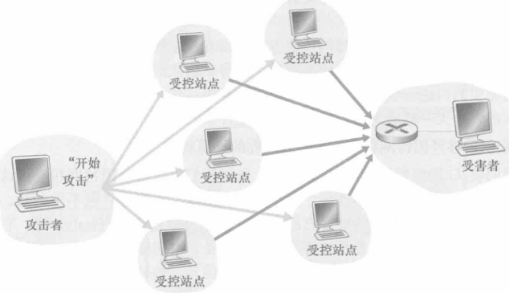

#### 网络攻击的一般步骤

*   **信息搜集**

    *   系统架构：如防火墙、路由等
    *   软件版本：漏洞情况
    *   端口开放：如22、23、80、443、445

*   **漏洞挖掘和利用**

    *   缓冲区溢出、竞争态Dirty Cow等漏洞
    *   侧信道

*   **攻击实施**

    *   安装后门、修改数据等

*   **痕迹消除**

## 1.7计算机网络和因特网的历史

### 1.7.1电路交换网络（1960）

电路交换的特性使得其不适合计算机之间的通信

*   连接建立时间过长
*   独享方式占用通信资源，不适合突发性很强的计算机之间的通信
*   可靠性不高：非常不适合军事通信

### 1.7.2分组交换的发展（1961-1972）

#### 早期分组交换概念（先后发明）

三个小组独立地开展分组交换的研究

*   1961：Kleinrock (MIT)，排队论，展现了分组交换的有效性
*   1964:：aran (美国兰德公司) – 军用网络上的分组交换
*   1964：Donald (英国) 等，英国国家物理实验室 NPL

#### 1967（ARPAnet\DARPA)

ARPAnet 由美国国防部高级研究计划局（Advanced Research Projects Agency）构想

**DARPA 相关**

*   《经济学人》称 DARPA 是“塑造现代世界的机构”
*   由德怀特·d·艾森豪威尔于 1958 年 2 月 7 日创建
*   曾数次改名
*   相关技术成果：气象卫星、GPS、无人机、隐形技术、语音接口、个人电脑

#### 1969

*   第一个 ARPAnet 节点开始工作

*   四个节点：

    *   UCLA
    *   Stanford
    *   UCSB
    *   Utah

    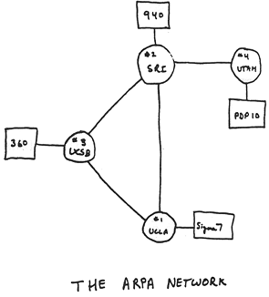

#### 1972

*   ARPAnet 公开演示（失败）
*   NCP（网络控制协议）：第一台主机-主机协议（RFC）
*   第一个电子邮件程序诞生
*   ARPAnet 拥有 15 个节点

### 1.7.3专用网络和网络互联（1972-1980）

*   1970: 夏威夷，ALOHAnet 分组无线电网络

*   1974: Cerf 和 Kahn - 互连网络的体系结构（因特网）

    *   **网络互联原则**

        *   极简主义，自主性 —— **互连网络不需要内部更改**
        *   **尽力而为**的服务模型
        *   **无状态**的路由
        *   **分散控制**

    *   定义今天的互联网架构：TCP、IP、UDP

*   1976: Metcalfe，在 Xerox PARC 发明以太网（Ethernet）

*   70 年代后期：专用架构：DECnet、SNA、XNA

*   1979: ARPAnet 拥有 200 个节点

### 1.7.4新协议，网络激增（1980-1990）

*   **1982**: smtp e-mail协议定义
*   **1983**: **TCP/IP**部署
*   **1983**: **DNS** 定义，完成域名到IP地址的转换
*   **1985**: **FTP** 协议定义
*   **1988**: **TCP**拥塞控制
*   new national networks: CSnet, BITnet, NSFnet, Minitel(法国)
*   **1985**: **ISO/OSI model** proposed
*   100,000 hosts connected to confederation of networks
*   1991：**NSFNET T1 Network**

### 1.7.5因特网爆炸，商业化、网络、新应用（90s，20s）

*   **Early 1990s**: ARPAnet退役

*   **1991**: NSF放宽了对NSFnet用于商业目的的限制（1995退役），**ASFNET**非营利性机构维护，后面叫**Internet**

*   **Early 1990s**: Web

    *   hypertext \[Bush 1945, Nelson 1960’s]
    *   **HTML**, **HTTP**: Berners-Lee
    *   **1994**: Mosaic (GUI), later Netscape → IE
    *   late 1990s: commercialization of the Web（商业化）

*   **late 1990s – 2000s**:

    *   新一代杀手级应用（即时讯息，P2P文件共享，社交网络等）更进一步促进互联网的发展
    *   网络安全变得重要
    *   规模达到5000万主机，1亿以上用户
    *   骨干链路以**Gbps**运行

### 1.7.6最新发展，scale, SDN, mobility, cloud（2005-present）

*   积极部署家庭宽带接入(10-100 Mbps)

*   **软件定义网络(SDN)**

*   **WiFi**高速无线接入日益普及：**4G/5G**、**WiFi**

*   **服务提供商(谷歌、FB、腾讯)创建了自己的网络**

    *   绕过商业互联网连接“接近”终端用户，提供“即时”访问社交媒体、搜索、视频内容……

*   企业在“**云**”中运行他们的服务 (e.g., Amazon Web Services, Microsoft Azure)

*   **移动互联网**的快速兴起 \~18B devices attached to Internet (2017)

*   **5G**、物联网、元宇宙等
