# 第2章：应用层

## 大纲

1.  应用层协议的原理，应用层协议的实现过程，进程通信概念，Web及HTTP协议
2.  Email, DNS 协议, P2P文件分发，视频流及内容分发网络
3.  CDN 基本概念，TCP 套接字编程, UDP 套接字编程

### 重点

*   Web应用和HTTP协议
*   不同协议应用场景

### 难点

*   DNS协议
*   UDP（协议、远过程调用、实时传输协议）

## 2.1应用层协议原理

**内容**

*   网络应用原理：网络应用架构

    *   客户-服务器模式

        *   client-server paradigm

    *   P2P 对等模式

        *   peer-to-peer paradigm

    *   传输层所提供的服务模型

*   网络应用的实例：互联网流行的应用层协议

    *   HTTP
    *   电子邮件 SMTP
    *   DNS
    *   P2P文件分发
    *   视频流应用, CDN 内容分发网

*   编程：网络应用程序

    *   socket API

**目标和要求：创建程序**

*   创建这样的程序

    *   在不同的端系统上运行

    *   通过网络基础设施提供的服务，实现彼此通信

        *   例如，Web 服务器软件与浏览器软件通信

*   网络核心中没有应用层软件

    *   网络核心没有应用层功能
    *   网络应用只在端系统上存在，因此可以支持快速开发和部署

### 2.1.1应用体系结构（application architecture）

规定了如何在各种端系统上组织该应用程序

#### 客户-服务器体系结构（C/S，client-server）

**服务器** server

*   一直运行的主机 always-on host

    *   固定的IP地址和端口号（约定）

    *   为了支持大规模、扩展性，通常位于数据中心

        *   多台服务器构建虚拟服务器

**客户端** clients

*   主动与服务器通信

*   与互联网有间歇性的连接

*   可能是动态IP地址

*   <u>不直接与其它客户端通信</u>

    *   示例：HTTP, IMAP(Internet Message Access Protocol), FTP(File Transfer Protocol)

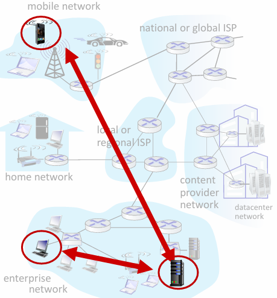

#### P2P体系结构

*   （几乎）没有一直运行的服务器

*   任意端系统之间可以进行通信

*   每个节点 既是客户端又是服务器

    *   **自扩展性**：新节点（peer）带来新的服务能力，当然也带来新的服务请求

*   参与的主机间歇性连接且可以改变IP地址

    *   管理复杂
    *   举例: P2P 文件共享 – Windows Update

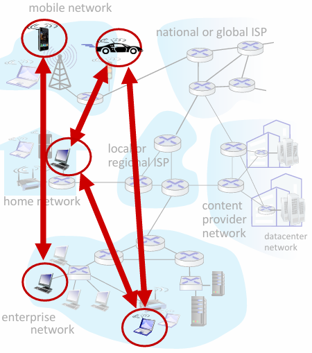

#### C/S和P2P体系结构的混合体

Napster

*   文件搜索 - C/S文件搜索：集中式
*   文件共享 - P2P文件传输：P2P式

Instant messaging 即时通信

*   Online detection 在线检测：集中式

    *   当用户上线时，向中心服务器注册其IP地址
    *   用户与中心服务器联系，以找到其在线好友的位置

*   两个用户之间聊天：P2P（可能的一种实现方式）

### 2.1.2进程通信（processes communicating）

**进程**（Process）：在主机上运行的应用程序

*   在同一个主机内，使用进程间通信机制 IPC 进行通信（操作系统定义）
*   不同主机，基于应用协议，通过交换报文（message）来通信

#### 客户和服务器进程

**客户**：发起通信的进程

**服务器**：等待连接的进程

**例子**

| <!-- --> | <!-- -->   | <!-- -->   |
| -------- | ---------- | ---------- |
|          | 客户       | 服务器     |
| C/S      | 浏览器     | Web服务器  |
| P2P      | 下载文件方 | 上载文件方 |


#### 套接字（socket，进程和计算机网络间的接口）

**核心概念**：是应用层进程与运输层之间的软件接口，是应用程序和网络之间的应用编程接口（API），是进程向网络发送报文、从网络接收报文的唯一入口

**层级与控制权**：

*   套接字位于同一台主机的应用层（进程）与运输层之间，是应用程序与网络的边界接口

*   **应用程序开发者**：可控制套接字的应用层端，仅能对运输层进行有限控制

    *   选择运输层协议
    *   设定部分运输层参数（如最大缓存、最大报文段长度等）
    *   无法控制套接字的运输层端与运输层的具体传输逻辑

*   **操作系统**：负责控制套接字的运输层端，以及运输层协议（如TCP）的缓存、变量等底层实现

**工作流程**：

*   发送端：应用进程将报文写入套接字，由操作系统控制的运输层（如TCP）处理后，经因特网传输
*   接收端：因特网传输的报文抵达后，由操作系统控制的运输层处理，再从套接字交付给应用进程，由进程完成报文处理

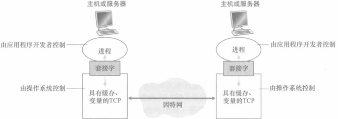

#### 进程寻址

用于标识收的进程，需要两种信息

*   主机的地址（IP，32位）

*   在目的主机中指定接收该进程的标识符

    *   HTTP server: 80
    *   mail server: 25

### 2.1.3应用层协议——如何交换报文

#### 定义

定义了运行在不同端系统上的应用程序进程之间，相互传递报文的规则，是网络应用的核心组成部分（但不等同于整个网络应用）

#### **要素**

*   **交换的信息类型**：如请求（request）、响应（response）
*   **消息的语法（syntax）**：格式结构，消息里包含哪些字段、这些字段用什么格式来描述（比如二进制、ASCII）
*   **消息语义（semantics）**：每个字段里信息的具体含义，比如某个字段代表状态码、某个字段代表请求路径
*   **进程何时以及如何发送和响应消息的规则**：通信的时序逻辑，比如什么时候发请求、收到请求后多久要响应、异常情况怎么处理，相当于通信的“对话流程”

#### **分类**

*   **公开协议（open protocols）**：

    *   由**RFC文档**标准化定义，是公开的技术规范
    *   允许不同厂商的系统共享、互通，只要遵循协议就能互相通信
    *   典型例子：HTTP（网页协议）、SMTP（邮件协议）

*   **专用（私有）协议（proprietary protocols）**：

    *   由特定公司/组织私有定义，不公开完整技术细节
    *   仅用于自家产品内部通信，不同厂商的私有协议不互通
    *   典型例子：微信（Wechat）、WhatsApp、Zoom的内部通信协议

### 2.1.4应用需要的运输层服务

#### 可靠性 reliability

*   有些应用则要求100%的可靠数据传输（如文件）
*   有些应用（如音频）能容忍一定比例以下的数据丢失

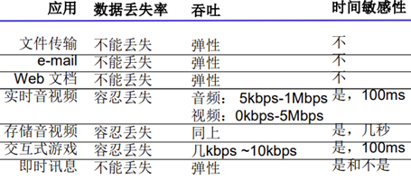

#### 吞吐量 throughput

*   应用可以请求 $r$ bps的确保吞吐量

*   带宽敏感应用：一些应用（如多媒体）必须需要最小限度的吞吐量，从而使得应用能够有效运转

*   弹性应用：一些应用能充分利用可供使用的吞吐

#### 定时保证 timing

*   一些应用出于时效性考虑，对数据传输有严格的时间限制

#### 安全性 security

*   encryption, data integrity……

    *   机密性
    *   完整性
    *   可认证性

### 2.1.5运输层提供的服务

#### TCP service

**TCP服务特性**

*   **可靠的传输服务**：无差错、按序、无丢失无冗余地交付所有发送数据，保障数据完整性

*   **面向连接**：要求在客户端进 程和服务器进程之间建立连接

    *   数据传输前，客户端与服务器进程需通过握手建立全双工<u>TCP连接</u>，传输完成后拆除连接

*   **流量控制**：匹配收发双方速率，避免发送方数据淹没接收方

*   **拥塞控制**：网络拥塞时抑制发送方发送速率，公平共享网络带宽，保障网络整体稳定

*   **不提供的服务**：时间保证、最小吞吐保证、原生安全加密（TCP/UDP均为明文传输）

#### UDP协议

**UDP服务特性**

*   **不可靠数据传输**：不保证数据无差错、按序、完整交付，报文可能乱序、丢失

*   **不提供的服务**：可靠传输、流量控制、拥塞控制、时间保证、带宽保证、建立连接

*   **核心优势（UDP存在的必要性）**：

    *   能够区分主机上的不同应用进程

        *   IP仅实现主机到主机通信，UDP在此基础上做进程级复用）
        *   在IP提供的主机到主机功能的基础上，区分了主机的应用进程

    *   无需建立连接，无握手开销，延迟极低，<u>适合事务型、低延迟需求的应用</u>

    *   不做检错、重传等可靠性工作，时间开销小，<u>适合对实时性要求高、对正确性要求不高</u>的场景（如音视频通话）

    *   无拥塞/流量控制，应用可按设定速率发送数据，不受TCP速率限制

        *   而在TCP上面的应用，应用发送数据的速度和主机向网络发送的实际速度 是不一致的

#### 常见应用与协议对应关系

| 应用场景            | 应用层协议      | 下层传输协议                      |
| ------------------- | --------------- | --------------------------------- |
| 电子邮件            | SMTP、IMAP      | TCP                               |
| 远程访问            | SSH             | TCP                               |
| Web浏览             | HTTP/2、HTTP/3  | TCP（HTTP/2）、QUIC/UDP（HTTP/3） |
| 文件传输            | SFTP/SCP、FTPS  | TCP                               |
| 流媒体（点播/直播） | HLS、DASH、RTMP | TCP/QUIC                          |
| VoIP/网络电话       | SIP、RTP/SRTP   | UDP（媒体流）、TCP/UDP（SIP信令） |


#### **TCP安全增强：TLS（传输层安全）**

**原生问题**：TCP/UDP套接字均无加密，明文传输（含账号、密码等敏感信息），易被链路嗅探

**TLS核心特性**：

*   在TCP之上、应用层实现，是TCP的加强版，不改变TCP基础传输逻辑

*   提供三大**核心安全能力**

    *   数据加密
    *   数据完整性校验
    *   端到端端点鉴别

*   有独立的套接字API，应用程序调用TLS套接字，明文经TLS加密后再交给TCP传输，接收端TLS解密后交付应用

*   HTTPS就是HTTP over TLS的典型应用

**实现方式**：应用程序集成SSL/TLS库，在应用层完成加密，对上层应用透明

#### 运输层协议不提供的服务

*   不提供吞吐量保证、定时保证
*   安全也需通过 TLS 等额外机制实现，原生无加密。

**TCP/UDP 能力边界**

*   TCP 实现了可靠的端到端数据传输
*   UDP 仅提供最基础的数据报传输服务
*   二者均无法保证数据传输的时间、吞吐量指标

## 2.2Web和HTTP

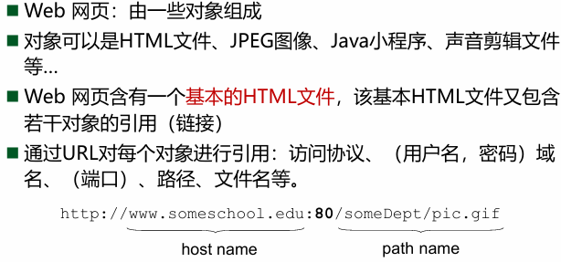

HTTP 1.0: RFC 1945

HTTP 1.1: RFC 2068

### 2.2.1HTTP概述

#### 基本概念

**HTTP**：超文本传输协议，hypertext　transfer　protocol

**作用**：Web的应用层协议

*   定义了Web客户向Web服务器请求Web页面的方式
*   定义了服务器向客户传送Web页面的方式

**模式**：C/S模式

*   客户端 client: 请求、接收和显示 Web对 象的浏览器
*   服务器 server:对请求进行响应， 发送对象的Web服务器

#### TCP——HTTP的支撑运输协议

1.  客户端发起一个与服务器的TCP连接(建立套接字)， 服务器端口号为 80
2.  服务器接受客户端的TCP连接请求
3.  浏览器(HTTP客户端) 与 Web服务器(HTTP服务器)交换HTTP 报文 (应用层协议报文)
4.  TCP连接关闭

#### 无状态

*   HTTP 是无状态的（stateless）
*   服务器并不维护关于客户端的任何信息

**原因**：维护状态的协议很复杂！

*   必须维护历史信息 (状态)
*   如果服务器/客户端死机，它们的状态信息可能不一致 （但二者的信息需要保持一致）
*   无状态的服务器能够支持更多的客户端

### 2.2.2持续和非持续

**持久**：指多个对象在同一个 TCP 连接上传输

**非持久**：每个请求 / 响应对应一个独立的 TCP 连接，请求完成后立即断开

#### 非持久HTTP连接（HTTP/1.0默认）

**工作步骤**

1.  客户端在端口号80发起 一个到服务器TCP连接
2.  客户端向TCP连接的 套接字发送HTTP请求报文 ，报文表示客户端需要对象
3.  检索出被请求的对象，将对象封装在一 个响应报文，并通过其套接字向客 户端发送
4.  服务器关闭连接
5.  客户端收到包含html文件 的响应报文，并显示html，然后对html文件进行检查，

若页面包含多个对象（如HTML+10张JPG），需重复该过程

※每个TCP连接只传输一个请求报文和一个响应报文

**往返时间RTT（时间开销）**

<u>定义</u>：一个小的分组从客户端到服务器，再回到客户端的时间（传输时间忽略）

※传输单个对象的响应时间 = 2RTT + 文件传输时间

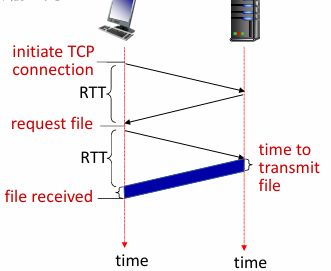

**缺点**：每个对象消耗2个RTT，操作系统需频繁为TCP连接分配资源，效率低下

#### 持久HTTP连接（HTTP/1.1默认）

**基础特性**：服务器发送响应后，保持TCP连接打开（Connection: keep-alive），同一连接上可传输后续请求和响应

**方式（流水\非流水）**

*   **非流水方式**：客户端需收到前一个响应后才能发送下一个请求，<u>每个对象仍需消耗约1个RTT</u>

*   **流水方式（默认模式）**：客户端遇到引用对象立即生成请求，无需等待前一个响应，<u>所有引用对象理论上仅消耗1个RTT</u>，效率大幅提升

**优势**：减少TCP连接建立/拆除开销，降低服务器资源消耗，提升传输速度

### 2.2.3HTTP报文格式

#### 请求报文

**结构**

*   共有内容

    *   换行

        *   cr：\r 回车符，将光标移动到当前行行首
        *   lf：\n 换行符，将光标向下移动一行

    *   空格：sp，理论上每一行的每一个部分间都应该有空格

*   请求行

    *   方法：GET、POST、HEAD、PUT、DELETE

    *   URL

    *   HTTP版本

    *   例子

        *   GET /index.html HTTP/1.1\r\n

*   首部行

    *   首部字段名:

        *   注：冒号是英文冒号
        *   Host：指定请求目标所在的主机
        *   Connection：控制连接的维持策略，持续\直接关闭
        *   User-agent：标识客户端的用户代理（如浏览器类型与版本），服务器可据此为不同客户端返回适配内容
        *   Accept：声明客户端可接收的响应内容类型，让服务器选择最优返回格式
        *   Accept-encoding：指定客户端支持的内容编码格式（如gzip、deflate），用于压缩传输提升效率
        *   Accept-language：声明客户端偏好的自然语言（如en-us、en），服务器可据此返回对应语言版本的资源

    *   值

    *   例子

        *   Host: www-net.cs.umass.edu\r\n
        *   Accept-Language: en-us,en;q=0.5\r\n

*   实体体（entity body）

    *   cr lf开头
    *   承载请求发送的实际数据
    *   GET 方法通常为空，POST 方法需填充数据

*   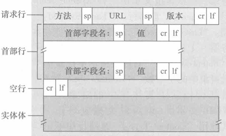

**方法**

*   GET：用于向服务器发送数据

    *   数据通过 URL 字段传递，拼接在 URL 后（‘?’后传参）

    *   适合向服务器获取数据，数据长度受限、安全性较低，无实体体

    *   例：https\://s.weibo.com/weibo<span style="color: rgb(255, 32, 32)">?</span>q=tictok\&xsort=hot\&haslink=1×cope=custom:2022-03-01:2022-03 02\&Refer=g

*   POST

    *   网页通常包括表单输入

        *   Web页面的特定内容依赖于用户在表单字段中的输入值

    *   包含在实体体中的输入被提交到服务器

    *   适合提交表单、上传大体积数据，数据传输更安全、长度不受 URL 限制

*   HEAD

    *   仅请求获取报文首部
    *   不返回请求对象
    *   用于故障跟踪、辅助搜索引擎检索

*   DELETE：请求服务器删除 URL 指定的文件 / 对象

*   PUT：

    *   上传新文件 / 对象
    *   用 POST 请求实体体内容完全替换指定 URL 上的已有文件

#### HTTP响应报文

**结构**

*   共有以及格式：同请求报文

*   状态行

    *   协议版本

    *   状态码

    *   短语

    *   例子

        *   HTTP/1.1 200 OK

*   首部行（header lines）

    *   首部字段名:

        *   Date：服务器生成响应的时间
        *   Server：服务器软件版本信息
        *   Last-Modified：资源最后修改时间（用于缓存校验）
        *   Content-Length：实体体数据的字节数
        *   Content-Type：实体体的数据类型（如text/html; charset=UTF-8）
        *   ETag：资源唯一标识（用于缓存校验）
        *   Connection：连接控制（如close/keep-alive）

    *   值

    *   例子

        *   Date: Tue, 08 Sep 2020 00:53:20 GMT
        *   ETag: "a5b-52d015789ee9e"

*   实体体（数据部分）

    *   cr lf开头
    *   报文的核心内容，即请求的目标资源（如HTML文件、图片、JSON数据等）

**HTTP常用状态码和短语（核心分类与常用码）**

*   2xx 成功类：请求被正常处理

    *   <u>200 OK</u>：请求成功，请求对象包含在响应报文的实体体中

*   3xx 重定向类：需要客户端进一步操作以完成请求

    *   <u>301 Moved Permanently</u>

        *   请求对象被永久转移，新URL在Location首部中指定
        *   客户端自动用新URL重新请求

    *   <u>304 Not Modified</u>

        *   资源未修改
        *   客户端可使用本地缓存的资源（无需重传实体体）

*   4xx 客户端错误类：客户端请求存在错误

    *   <u>400 Bad Request</u>：通用错误码，表示请求报文语法错误，服务器无法解读

    *   <u>404 Not Found</u>：请求的资源在服务器上不存在

*   5xx 服务器错误类：服务器处理请求时发生错误

    *   <u>505 HTTP Version Not Supported</u>：服务器不支持请求报文使用的HTTP版本

### 2.2.4用户-服务器状态：cookie

#### **核心作用**

*   为HTTP补充状态管理能力

*   允许站点对用户进行<u>身份识别、状态跟踪</u>

    *   实现购物车、个性化推荐、用户会话维持等功能

#### **四大组成部分**

*   **响应首部**：服务器在HTTP响应报文中通过Set-cookie首部行，向客户端下发唯一识别码（set cookie XX)

*   **请求首部**：客户端浏览器在后续HTTP请求报文中，通过Cookie首部行，将识别码回传给服务器（cookie = XX)

*   **客户端存储**：浏览器在用户端系统中保留cookie文件，由浏览器管理

*   **服务器端存储**：Web站点后端有个数据库

    *   网站后端数据库中存储与cookie对应的用户数据、会话信息

**Cookie的工作流程（以Susan访问Amazon为例）**：

*   首次访问

    1.  Susan发送请求
    2.  服务器生成唯一ID并在后端建表
    3.  响应报文携带Set-cookie: 1678
    4.  浏览器存储cookie

*   后续访问：

    1.  每次请求Amazon页面，浏览器自动在请求报文中携带Cookie: 1678
    2.  服务器根据ID识别用户，执行个性化操作（如维护购物车）

*   跨时段访问

    *   一周后再次访问，浏览器仍携带Cookie: 1678
    *   服务器可恢复用户状态、推荐历史内容

    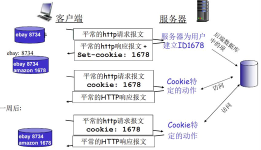

**Cookie的应用场景**

*   用户验证：确认登录身份。
*   购物车：关联用户选购商品。
*   个性化推荐：基于历史访问行为推荐内容。
*   用户会话状态：维持Web邮箱等应用的连续会话

#### Cookie与隐私争议

*   允许站点获取用户信息，存在隐私隐患

    *   Cookies允许站点知道太多关于 用户的信息

*   第三方Cookie：跨多个网站跟踪用户公共标识，被广泛视为对用户隐私的侵犯

### 2.2.5Web Cache缓存（代理服务器）

#### 目标

不访问原始服务器就满足客户的需求

#### 定义

能够代表初始Web服务器来满足HTTP请求的网络实体

*   有自己的磁盘存储空间

*   在空间中保存最近请求过的对象的副本

*   既是客户端又是服务器

    *   服务器：接收浏览器请求并发回响应
    *   客户：向初始服务器发起请求

#### 使用步骤

浏览器将所有HTTP请求发送到缓存

*   在缓存中的对象：缓存直接返回对象
*   如对象不在缓存，缓存请求原始 服务器，然后再将对象返回给客户端

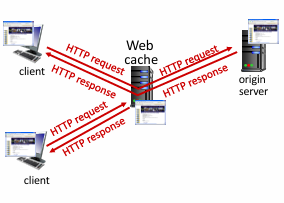

#### 购买方、为什么要使用Cache

**购买**：通常由ISP购买并安装

**原因**

*   降低客户端的请求响应时间

    *   cache is closer to client
    *   cache和client的瓶颈带宽更高

*   可以大大减少一个机构内部网络与 Internet接入链路上的流量

    *   大大降低一个机构需要的带宽和费用

*   互联网大量采用了缓存caches

    *   使“较弱的”内容提供者能够更有效 地交付内容

#### 实际场景计算证明

**基础公式**

*   链路实际数据速率：请求率 × 平均对象大小
*   链路流量强度（利用率）：实际数据速率 ÷ 链路带宽
*   总端到端延时：LAN延时 + 接入链路排队延时 + 互联网往返延时(RTT)

**基准场景**：无缓存的原始网络（瓶颈分析）

1.  场景参数

    *   接入链路带宽：1.54 Mbps
    *   RTT：2 sec
    *   平均对象大小：100K bits
    *   请求率：15 req/sec
    *   LAN带宽：1 Gbps（远大于接入链路，无瓶颈）

2.  计算过程

    *   计算实际数据速率 浏览器每秒请求15个对象，每个100K bits，因此： $\text{实际速率} = 15\ \text{req/s} × 100\ \text{K bits/req} = 1500\ \text{K bits/s} = 1.50\ \text{Mbps}$

    *   计算链路流量强度

        *   接入链路利用率： $\rho_{\text{接入}} = \frac{1.50\ \text{Mbps}}{1.54\ \text{Mbps}} ≈ 0.97$

        *   LAN链路利用率： $\rho_{\text{LAN}} = \frac{1.50\ \text{Mbps}}{1000\ \text{Mbps}} = 0.0015$

3.  性能分析

    *   接入链路利用率高达97%，接近饱和，会产生严重的排队延迟（M/M/1排队模型中，排队延时随利用率呈指数增长，利用率>0.8时延时急剧上升）

    *   LAN利用率仅0.15%，无任何瓶颈。

    *   总延时 = LAN延时(可忽略)+ 接入链路排队延时(秒级，严重)+ 互联网RTT(2s)

        *   最终总延时远大于2s，用户体验极差。

**修改方案**

1.  升级接入链路带宽（治标不治本）

    *   场景参数

        *   接入链路带宽：1.54 Mbps→154 Mbps（T3链路）

    *   计算过程

        *   实际数据速率不变： $\text{实际速率} = 1.50\ \text{Mbps}$

        *   计算链路流量强度： $\rho_{\text{接入}} = \frac{1.50\ \text{Mbps}}{154\ \text{Mbps}} ≈ 0.0097$

    *   性能分析

        *   接入链路利用率仅0.97%，排队延迟完全消失，接入延时降至ms级

        *   总延时 = LAN延时(ms) + 接入延时(ms) + 互联网RTT(2s)，最终总延时约<u>2s</u>，仅消除了排队延迟，<u>未缩短互联网往返时间</u>

    *   核心缺点

        *   <u>成本极高</u>：T3链路月租是T1的数十倍

        *   仅解决了链路瓶颈，未优化核心的跨网延时

2.  部署本地Web缓存（核心优化方案）

    *   核心原理：Web缓存（代理服务器）部署在机构LAN内，预先存储热门网页资源：

        *   当浏览器请求资源时，<u>优先向缓存服务器发起请求</u>：

        *   缓存命中：直接从本地LAN返回资源，无需经过公网接入链路，延时仅ms级。

        *   缓存未命中：缓存服务器代浏览器向源服务器请求资源，缓存后再返回给浏览器，仅60%的流量经过接入链路。


    *   核心优势

        *   <u>同时降低链路负载、缩短总延时，且成本极低</u>（仅需一台服务器硬件）

    *   场景参数

        *   接入链路带宽保持1.54 Mbps，其余参数不变
        *   假设缓存命中率为40%：即40%的请求由缓存直接响应，60%需回源

    *   计算过程

        *   计算接入链路实际数据速率：  $\text{实际速率} = (1 - 40\%) × 1.50\text{Mbps} = 0.6 × 1.50 = 0.9\text{Mbps}$

        *   计算接入链路流量强度： $\rho_{\text{接入}} = \frac{0.9\ \text{Mbps}}{1.54\ \text{Mbps}} ≈ 0.58$

        *   计算总端到端延时：总延时 = 缓存命中请求的延时 + 缓存未命中请求的延时

            *   缓存命中（40%）：本地LAN内传输，延时仅为ms级（≈0s，可近似为0）
            *   缓存未命中（60%）：需回源到源服务器，延时 = 接入链路排队延时（≈0.01s） + 互联网RTT（2s） = 2.01s
            *   $\text{总延时} = 0.6 \times 2.01\ \text{s} + 0.4 \times 0\ \text{s} \approx 1.2\ \text{s}$

    *   性能分析

        *   接入链路利用率58%，排队延迟显著降低，链路负载压力大幅缓解
        *   总延时约1.2s，比升级154Mbps链路（≈2s）缩短了40%，用户体验大幅提升
        *   成本仅为一台缓存服务器，远低于昂贵的带宽升级，性价比极高。

**排队延时推导**

*   基准场景：无缓存（ $\rho=0.97$ ）

*   完整计算

    *   计算流量强度 $\rho$ ： $\rho = \frac{La}{R} = \frac{100 \times 10^3\ \text{bits} \times 15\ \text{pkt/s}}{1.54 \times 10^6\ \text{bps}} = \frac{1.5 \times 10^6}{1.54 \times 10^6} ≈ 0.97$

    *   计算平均服务时间 $\frac{1}{\mu}$ ：服务时间 = 传输1个分组的时间 = 分组长度 ÷ 链路带宽  $\frac{1}{\mu} = \frac{L}{R} = \frac{100 \times 10^3\ \text{bits}}{1.54 \times 10^6\ \text{bps}} ≈ 0.0649\ \text{s} ≈ 64.9\ \text{ms}$

    *   计算排队延时 $T_q$ ： $T_q = \frac{\rho}{1-\rho} \times \frac{1}{\mu} = \frac{0.97}{1-0.97} \times 0.0649 ≈ 32.33 \times 0.0649 ≈ 2.10\ \text{s}$

*   结论：排队延时≈2.1s，是服务时间（64.9ms）的32倍，总延时 = 排队延时 + RTT（2s）≈4.1s，用户体验极差

#### 更新缓存的方法：条件GET方法

**内容**

*   请求报文使用GET方法

*   首部行包含一个“If-modified-since: \<date>”

*   例子GET /fruil/kiwi.gif HTTP/1.1Host: www\.exoticquinceineIf-modified-since: Wed, 9 Sep 2015 09:23:24

**步骤**

1.  首次请求和响应

    *   响应报文包括对象
    *   缓存器缓存修改日期

2.  二次请求，缓存器发送条件GET执行最新检查

    *   有更新：响应报文携带新对象

    *   无更新：响应报文不携带

        *   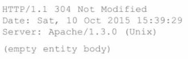
        *   注：示例状态行中位304 Not Modified，告诉缓存器可以使用该对象，能向请求的浏览器转发缓存的副本

    *   ※无论是否更新都会有响应报文

### 2.2.6HTTP/2

#### HTTP1的缺陷

**HTTP/1.1 核心痛点**

*   持久连接的流水线请求采用<u>先到先服务（FCFS）调度</u>，服务器必须按请求顺序返回响应，大对象会阻塞后续所有小对象，产生<u>队头阻塞</u>（HOL Blocking）

*   TCP 丢包重传会暂停整个连接的所有对象传输，进一步放大延迟

*   浏览器通过多 TCP 并行连接缓解阻塞（并占据更多带宽），但会增加服务器连接开销，无法从根本解决问题

#### HTTP2的目标

*   摆脱/减少传送单一Web页面时并行的TCP连接

    *   减少套接字数量
    *   允许TCP拥塞控制如设计般运行

*   **核心目标**：减少多对象HTTP请求的延迟

#### HTTP/2的解决方案

增加了服务器向客户端发送对象的灵活性

*   <u>复用格式</u>：方法、状态码，大多数头部字段与HTTP 1.1相同

*   <u>二进制分帧层</u>：将对象划分为帧，调度帧以缓解HOL阻塞，二进制编码更高效、帧更小、出错率更低

    *   最重要的改进

*   <u>请求优先级与灵活调度</u>：基于客户端指定的对象优先级的请求对象的传输顺序(不一定是 FCFS)

*   <u>服务器推送</u>（Server Push）：服务器可主动推送未请求的关联资源，无需等待客户端逐个请求，消除额外时延

#### HTTP/2对象分帧

**概念**：将每个报文分成帧，在相同TCP连接上交错发送帧

**负责部分**：由成帧子层完成

**操作**：以响应报文为例，首部行一帧，报文体被划分为一帧以用于更多的附加帧，最后在客户端的成帧子层拼装

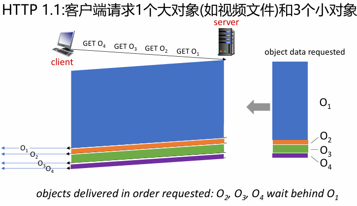

#### HTTP/2请求优先级和推送

**方法**

*   为每个报文分配1\~256的权重，越大优先级越高
*   用户也可以指明相关的报文段ID，说明每个报文段与其他报文段的相关性

**推送**：允许服务器为一个客户请求发送多个响应，消除了因等待请求而产生的额外时延

#### HTTP/3

**原因**：TCP 本身导致的传输层堵塞无法由HTTP/2解决

**HTTP/3 核心信息**

*   核心定位：基于 QUIC 协议，彻底解决 TCP 层队头阻塞，进一步优化传输性能

*   核心架构：HTTP/3 协议栈为「HTTP over QUIC → TLS 1.3 → 类 TCP 拥塞控制/丢包恢复 → UDP → IP」，替代 HTTP/2 的「HTTP/2 → TLS → TCP → IP」架构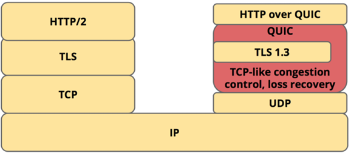

核心优势

*   基于 UDP 实现，在 UDP 之上实现类 TCP 的拥塞控制、丢包恢复、流量控制，每个请求/流独立处理丢包，单个流的丢包不会阻塞其他流，彻底消除 TCP 层 HOL 阻塞
*   基于 TLS 1.3 实现 0-RTT 握手，大幅降低首次访问延迟
*   基于连接 ID 而非四元组标识连接，支持连接迁移，客户端切换网络时无需重新握手
*   QUIC 默认加密，原生实现 HTTPS 安全能力

## 2.3电子邮件 E-mail

### 2.3.1邮件的基本概念

#### 3个主要组成部分

*   **用户代理**：user agents

    *   邮件阅读器
    *   撰写、编辑和阅读邮件（比如Gmail，Apple Mail）
    *   输出和输入邮件保存在服务器上

*   **邮件服务器**：mail servers

    *   邮箱：管理和维护发送给用户的邮件
    *   输出报文队列(message queue)：保持待发送邮件报文（尤其是在发送不成功时）

*   **简单邮件传输协议**：SMTP

    *   simple mail transfer protocol

    *   发送Email报文

    *   主要的应用层协议

        *   TCP 可靠数据传输服务
        *   client：发送方邮件服务器
        *   server：接收端邮件服务器

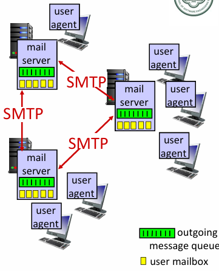

### 2.3.2STMP

#### SMTP 定义与基础

依据标准：RFC 5321 定义了 SMTP，它是因特网电子邮件的核心

**传输协议**：使用 TCP 在客户端和服务器之间传送报文，端口号为 25

**传输方式**：支持<u>直接传输</u>，即从发送方服务器到接收方服务器

#### SMTP 传输的3个阶段

1.  SMTP handshaking (greeting)：握手阶段
2.  SMTP transfer of messages：传输报文阶段
3.  SMTP closure：关闭连接阶段

#### SMTP 命令与响应

*   交互形式：采用<u>命令/响应</u>交互，类似 HTTP，均为 ASCII 文本形式。

    *   命令 (commands)：由客户端发送，为 ASCII 文本
    *   响应 (response)：由服务器返回，包含状态码和状态信息

*   报文**编码**：报文<u>必须为 7位 ASCII 码</u>，取值范围 0-127

#### 示例

**SMTP 报文传输**

1.  Alice 使用用户代理撰写邮件并发送给 bob\@someschool.edu
2.  Alice 的用户代理将邮件发送到她的邮件服务器，邮件被放入报文队列
3.  运行在 Alice 邮件服务器上的 SMTP 客户端打开到 Bob 邮件服务器的 TCP 连接
4.  SMTP 客户端通过 TCP 连接发送 Alice 的邮件
5.  Bob 的邮件服务器将邮件放到 Bob 的邮箱
6.  Bob 调用用户代理阅读邮件

**简单的SMTP报文交互**

*   客户主机名：crepes.fr
*   服务器主机名：hamburger.edu

<!---->

```
S: 220 hamburger.edu
C: HELO crepes.fr
S: 250  Hello crepes.fr, pleased to meet you
C: MAIL FROM: <alice@crepes.fr>
S: 250 alice@crepes.fr... Sender ok
C: RCPT TO: <bob@hamburger.edu>
S: 250 bob@hamburger.edu ... Recipient ok
C: DATA
S: 354 Enter mail, end with "." on a line by itself
C: Do you like ketchup?
C: How about pickles?
C: .
S: 250 Message accepted for delivery
C: QUIT
S: 221 hamburger.edu closing connection
```

#### SMTP 与 HTTP 对比

*   **HTTP**：采用 <u>client pull</u>（客户端拉取）模式

*   **SMTP**：采用 <u>client push</u>（客户端推送）模式

*   **共性**：二者均为 ASCII 形式的命令/响应交互，且包含状态码

### 2.3.3邮件报文格式

#### 标准

定义了电子邮件信息本身的语法 (类似HTML定义了Web文档语法)\[RFC 5322，曾为822]

#### 结构

**首部行** header lines, e.g.,

*   To:
*   From:
*   Subject:
*   在邮件正文消息区不同于 SMTP MAIL FROM:, RCPT TO: 等命令

空白行

**报文体 **Body: 报文，只能是ASCII码字符


#### 多媒体邮件扩展

**核心原理**：不修改 SMTP 协议本身，仅通过在邮件首部添加额外字段，对非 ASCII 数据进行编码转换，让二进制数据可以通过 SMTP 传输。

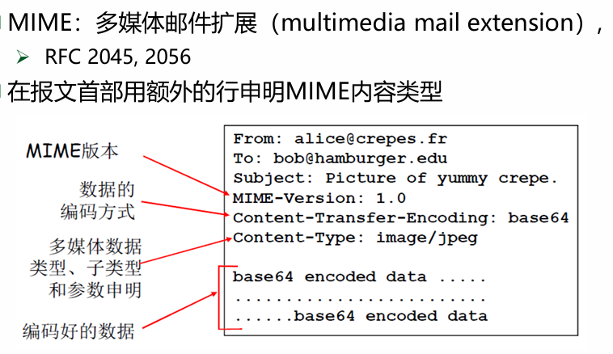

### 2.3.4邮件访问协议

#### 基本概念

**目的**：用于访问服务器取回邮件

**方法**

*   HTTP：基于Web的电子邮件或只能手机上的客户端

    *   Gmail, Hotmail, Yahoo!Mail 等
    *   在SMTP、IMAP/POP3基础上提 供基于Web的界面交互

*   POP3：邮局访问协议（Post Office Protocol）\[RFC 1939]

*   IMAP：Internet 邮件访问协议 Internet Mail Access Protocol \[RFC 3501]

#### POP3

*   两个阶段

    *   用户确认阶段
    *   事物处理阶段

*   两种配置模式

    *   下载并删除（节省空间）
    *   下载并保留

*   POP3 在会话过程中是无状态的

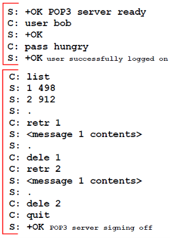

#### IMAP

*   IMAP 服务器将每个邮件（email）与一个文件夹联系起来

    *   允许用户用目录来组织报文
    *   <u>能够远程管理文件夹</u>

*   允许用户读取报文某些部分

    *   例如，只读取头部
    *   适用低带宽连接

*   IMAP 在会话过程中保留用户状态

    *   目录名、报文ID与目录名之间映射

## 2.4DNS：域名系统，The Domain Name System

### 2.4.0DNS历史（简单的解决方案）

*   ARPANET 的名字解析方案

    *   主机名：没有层次的一个字符串（一个平面）
    *   集中式维护：单个主机名-IP地址的映射文件：Hosts.txt
    *   每台主机定时从站点取文件

*   存在的问题

    *   当网络中主机数量很大时，服务器存在性能瓶颈
    *   没有层次的主机名称很难分配
    *   文件的管理、发布、查找都很麻烦

### 2.4.1DNS提供的服务

#### 识别主机的两种方法：主机名和IP地址（需求）

**主机名**：hostname，如www\.google.com

**IP**：ip地址

※注意：主机名方便人类阅读，但是不方便路由器处理，路由器则喜欢定长的、有层次结构的IP地址

#### DNS 的基本概念和结构

**定义**

*   一个由<u>分层</u>的DNS服务器实现的<u>分布</u>式数据库

*   一个使得主机能够查询分布式数据库的<u>应用层</u>协议

*   运行在<u>UDP上</u>，端口号为53

    *   服务器通常是运行BIND软件的UNIX及其

#### DNS 的服务

*   **主机名到IP地址转换的目录服务**

    *   主要任务

*   **主机别名**

    *   复杂主机名的主机能拥有至少一个别名

    *   主机别名比主机规范吗名更容易记忆

        *   规范名：relay1.west-coast.enterprise.com
        *   别名：enterprise.com

    *   程序可以调用DNS来获得对应的规范名和IP地址

*   **邮件服务器别名**

    *   邮件地址：xx\@xxx.com
    *   但是邮件服务器的主机名可能更加复杂
    *   邮件程序可以调用DNS来获得对应的规范名和IP地址
    *   一个公司的web服务器和邮件服务器可能用同一主机名

*   **负载分配**

    *   DNS 也用于在冗余的服务器之间进行负载分配
    *   多台服务器组成一个IP地址集合和一个规范主机名相联系
    *   接受请求时，这些地址循环使用，实现负载分配

#### 使用步骤

1.  同一台用户主机上运行着 DNS 应用的客户端。
2.  浏览器从上述 URL 中抽取出主机名 www\.someschool.edu，并将主机名传给 DNS 应用的客户端。
3.  DNS 客户向 DNS 服务器发送一个包含主机名的请求。
4.  DNS 客户最终会收到一份回答报文，其中含有对应于该主机名的 IP 地址。
5.  一旦浏览器接收到来自 DNS 的该 IP 地址，它就向位于该 IP 地址 80 端口的 HTTP 服务器进程发起一个 TCP 连接

### 2.4.2DNS工作原理概述

#### 单一DNS服务器的缺陷——为什么要使用分布式、层次

*   **单点故障**（single point of failure）：如果该 DNS 服务器崩溃，整个因特网随之瘫痪
*   **通信容量**（traffic volume）：单个 DNS 服务器不得不处理所有的 DNS 查询（HTTP 请求报文、电子邮件报文服务）
*   **远距离的集中式数据库**（distant centralized database）：单个 DNS 服务器不可能“邻近”所有查询客户。这将导致严重的时延。
*   **维护**（maintenance）。单个 DNS 服务器将不得不为所有的因特网主机保留记录。这不仅将使这个中央数据库无比庞大，而且它还不得不为解决每个新添加的主机而频繁更新。

总的来说，在单一 DNS 服务器上运行集中式数据库完全没有可扩展能力。因此，DNS 采用了分布式的设计方案

#### DNS: 一个分布式的、分层的数据库

*   **根域名服务器（Root DNS Servers）**：

    *   其他服务器无法解析的DNS信息，由根域名服务器提供

    *   由ICANN（互联网名称与数字地址分配机构）管理根DNS域

    *   全球<u>13</u>个逻辑根域名“服务器”，每个“服务器”备份多次

*   **顶级域名服务器（Top Level Domain, TLD DNS Servers）**：

    *   负责.com、.org、.edu 等等顶级域，以及所有国家级顶级域名（如.cn、.uk、.fr、.ca、.jp）

    *   如

        *   Verisign Global Registry Services维护.com TLD 服务器
        *   Educause 维护.edu TLD 服务器

*   **权威域名服务器（Authoritative DNS Servers）**：

    *   组织机构自己的DNS服务器，为组织的各个主机名—IP映射提供权威的信息
    *   由组织或服务提供者进行维护（可委托第三方）

*   <u>本地DNS服务器（Local DNS servers）</u>：

    *   当主机进行DNS查询时，请求首先发送到本地DNS服务器

        *   本地DNS服务器返回应答

            *   从本地缓存返回域名-IP映射信息（可能已经过时）
            *   转发请求到DNS层次结构进行解析

    *   每个ISP都有本地DNS名称服务器

        *   macOS：% scutil --dns
        *   Windows：>ipconfig /all

    *   严格来讲，<u>本地DNS服务器不属于层次结构</u>

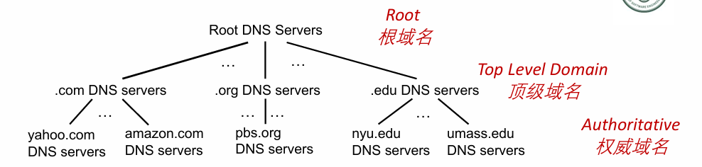

**示例**：客户端查询www\.amazon.com的对应IP地址

*   询问root DNS 根域名服务器，找到.com DNS 服务器
*   询问.com DNS 服务器得到amazon.com DNS 服务器
*   询问amazon.com的DNS服务器，以获得www\.amazon.com的IP地址

#### DNS命名空间（Name Space）

*   **域名（Domain Name）**：从本域往上，直到树根，中间使用“.”间隔不同的级别，例如sysu.edu.cn

*   **域的域名**：可用于表示一个子域

    *   例如 .com是一个域
    *   sse.sysu.edu.cn 是sysu.edu.cn 的一个子域

*   **主机的域名**：一个域上的一个主机，

    *   例如sse.sysu.edu.cn也会对应一个唯一的主机（服务器）

*   **<u>域名的管理</u>**：

    *   一个域管理其下的子域

        *   如.jp被划分为ac.jp、co.jp
        *   .cn被划分为edu.cn、com.cn

    *   创建一个新的域，必须征得它所属域的同意

    *   域与物理网络无关

        *   域遵从组织界限，而不是物理网络

            *   一个域的主机可以不在一个物理网络
            *   一个物理网络的主机不一定在一个域

        *   域的划分是逻辑的，而不是物理的

#### 域名服务器，区域zone

*   区域的划分由区域管理者自己决定

*   将DNS命名空间划分为互不相交的区域，每个区域都是树的一部分

*   域名服务器（DNS Server）分类

    *   Root DNS Server根DNS服务器
    *   TLD DNS Server顶级域DNS服务器
    *   权威DNS服务器
    *   本地DNS服务器（位于DNS层次结构之外）

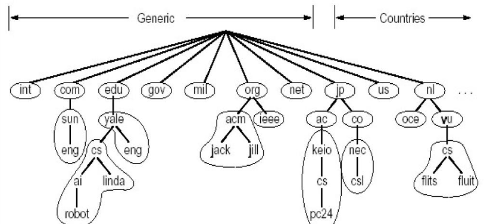

#### DNS 解析过程

**解析过程**

*   应用调用解析器（resolver，本地客户端）：解析器作为UDP客户向本地DNS服务器（Local Name Server）发出查询报文，本地DNS服务器返回响应报文（name/ip）

*   目标域名在本地域名服务器（Local Name server）中

    *   情况1：查询的名字在该区域内部（如在中大访问sse.sysu.edu.cn）
    *   情况2：缓存（caching）

*   本地域名服务器不能解析域名时，有两种查询方式

    *   递归查询
    *   迭代查询

**递归查询（Recursive query）**：

*   示例：engineering.nyu.edu的主机想知道gaia.cs.umass.edu的IP地址

*   名字解析负载集中于前联络的名字服务器上

    *   the first-contacted name server

*   步骤

    1.  主机向本地DNS服务器发起查询请求
    2.  本地器向根服务器发送查询报文
    3.  根识别edu后缀，向TLD转发查询
    4.  TLD 向权威服务器转发查询
    5.  权威DNS服务器返回gaia.cs.umass.edu 的IP地址给TLD
    6.  TLD 将IP地址返回给根
    7.  根DNS服务器将IP地址返回给本地DNS服务器
    8.  本地DNS服务器将最终IP地址返回给发起请求的主机

*   问题：根服务器的负担太重

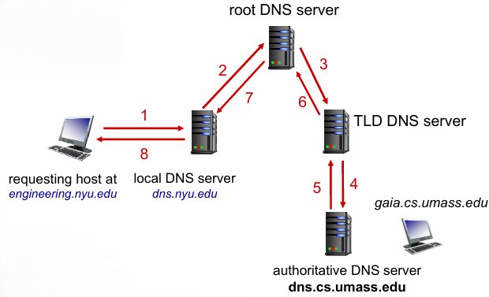

**迭代查询（Iterated query）**：

*   示例：engineering.nyu.edu的主机想知道gaia.cs.umass.edu的IP地址

*   被联系的服务器用其他服务器名回复给请求者

    *   “我无权知道这个名字，可以问问谁”

*   最后由权威名字服务器给出解析结果

*   步骤

    1.  向本地DNS发起请求（递归）

    2.  本地询问根服务器

    3.  根注意到edu后缀返回TLD地址列表<u>给本地</u>

    4.  本地向TLD发送查询报文

    5.  TLD 返回权威服务器地址<u>给本地</u>

    6.  本地向权威服务器重发查询报文

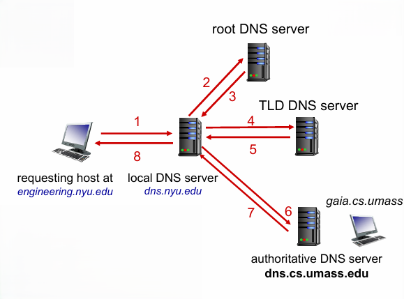

#### DNS缓存（Caching DNS Information）

*   一旦域名服务器获得了一个映射，就将该映射缓存起来

    *   缓存提高了响应时间

    *   缓存条目在一段时间（TTL，默认两天）后超时（消失）

    *   根服务器、TLD 服务器通常缓存在本地名称服务器中

        *   不需要被频繁访问

*   缓存的条目可能过期

    *   如果被访问的主机更改了IP地址，可能直到所有的TTL过期才会被知道
    *   尽力而为的转换映射：best-effort name-to-address translation

### 2.4.3DNS记录和报文

#### 资源记录（resource records）

**作用**：维护域名-IP地址(以及其它信息)的映射关系

**位置**：DNS 服务器的分布式数据库中

**格式：Name，Value，Type、 TTL**

*   Domain\_name：域名

*   Value 值：可以是数字、域名或ASCII字符串

*   Type 类别：资源记录的类型

    *   Name和Value的意义取决于Type

*   TTL：time to live : 生存时间

    *   权威，缓存记录

**Type**

*   type=A

    *   提供了标准的主机名→IP地址的映射


    *   Name：主机名
    *   Value：IP 地址（主机对应）

*   type=NS

    *   用于沿着查询链路的DNS查询


    *   Name：域名 (e.g., foo.com)

    *   Value：域名的权威服务器的标准<u>主机名</u>

        *   不是IP地址
        *   是一个知道如何获得该域中主机IP地址的权威DNS服务器的主机名

*   type=CNAME

    *   由别名查询规范主机名


    *   name：主机别名 alias name

        *   www\.ibm.com 是 servereast.backup2.ibm.com 的别名

    *   Value：规范主机名

*   type=MX

    *   由别名找到邮箱规范主机名


    *   Value：为 name 对应的邮件服务器规范主机名

        *   foo.com, mail.bar.foo.com, MX

#### DNS 报文

※查询和回答报文格式相同

| <!-- -->                                                                       | <!-- -->                       |
| ------------------------------------------------------------------------------ | ------------------------------ |
| 标识符（identification）                                                       | 标志（flags）                  |
| 问题数（# questions）                                                          | 回答 RR 数（# answer RRs）     |
| 权威 RR 数（# authority RRs）                                                  | 附加 RR 数（# additional RRs） |
| 问题（questions）（variable # of questions，查询的名字和类型字段）             |                                |
| 回答（answers）（variable # of RRs，对查询的响应中的 RR）                      |                                |
| 权威（authority）（variable # of RRs，权威服务器的记录）                       |                                |
| 附加信息（additional info）（variable # of RRs，可被使用的附加“有帮助的”信息） |                                |


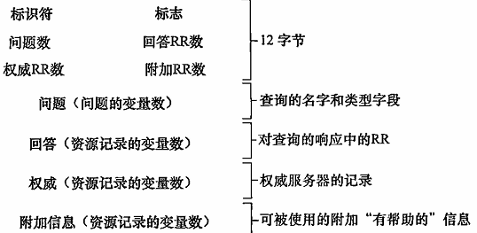

**报文首部（message header，共12字节）**：

*   **标识符（ID）**：16 bit，对于查询，回复查询使用相同的标识符，用于匹配发送的请求和接收的回答

*   **flags（标志位）**：

    *   查询/应答：1bit

        *   0：查询
        *   1：回答

    *   权威应答：1bit

        *   当DNS服务器是所请求名字的权威DNS服务器时，该标志位放在回答报文中

    *   希望递归：1bit

        *   客户（主机或DNS服务器）在该DNS服务器没有某记录时，希望它执行递归查询时置位
        *   回答报文

    *   递归可用：1bit

        *   DNS 服务器支持递归查询时，在回答报文中置位

*   **# questions（问题数，问题区域）**：2字节，指出问题区域出现的查询数量

*   **# answer RRs（回答RR数）**：2字节，指出回答区域出现的资源记录数量

*   **# authority RRs（权威RR数）**：2字节，指出权威区域出现的资源记录数量

*   **# additional RRs（附加RR数）**：2字节，指出附加信息区域出现的资源记录数量

**报文其余部分（可变长度）**：

*   **questions（问题区域，variable # of questions）**：包含正在进行的查询信息，包含：

    *   名字字段：正在被查询的主机名
    *   类型字段：指出有关该名字的正被询问的问题类型（如A，MX）

*   **answers（回答区域，variable # of RRs）**：来自DNS服务器的回答，包含

    *   对最初请求的名字的资源记录（RR）

        *   每个资源记录包含Type、Value、TTL字段

    *   可包含多条RR，一个主机名可对应多个IP地址

*   **authority（权威区域，variable # of RRs）**：包含

    *   其他权威服务器的记录

*   **additional info（附加信息区域，variable # of RRs）**：包含

    *   其他有帮助的记录
    *   例如MX请求的回答中，附加区域可提供邮件服务器规范主机名对应的IP地址的A记录

**补充工具**：

*   **nslookup程序**：多数Windows和UNIX平台可用，可向任意DNS服务器（根/TLD或权威）发送DNS查询，接收回答后以人可读格式显示记录，可用于DNS报文的手动测试与排查

#### 在DNS数据库中插入记录（如何在DNS层面搭建网站）

**DNS插入记录的核心步骤**：

*   **在上级域的DNS服务器中增加两条记录**：

    1.  指向这个新增的子域的域名（NS记录）
    2.  域名服务器的地址（A记录）

*   **在新增子域的名字服务器上，运行域名服务器DNS Server**：

    *   负责本域的名字解析：名字 -> IP地址

**实例：新创业公司“乌托邦网络（Network Utopia）”注册域名networkuptopia.com**：

*   **步骤1：在DNS注册商（如Network Solutions）注册域名**

    *   提供新增域名、对应权威名称服务器IP地址（主、从服务器）

    *   注册商向.com TLD服务器插入两条资源记录（RRs）：

        *   NS记录：(networkuptopia.com, dns1.networkuptopia.com, NS)，指定该域的权威服务器
        *   A记录：(dns1.networkuptopia.com, 212.212.212.1, A)，指定权威服务器的IP地址

*   **步骤2：在本地创建IP地址为212.212.212.1的权威服务器**

    *   为www\.networkuptopia.com键入A记录，完成主机名到IP的映射
    *   为\[mail].networkuptopia.com（邮件服务器）添加MX记录
    *   补充：“mail”可移除，如nanyh\@mail.sysu.edu.cn与nan1\@fudan.edu.cn的区别

**补充说明**：

*   注册登记机构（registrar）是ICANN授权的商业实体，负责验证域名唯一性、将域名录入DNS数据库
*   权威DNS服务器中的记录传统为静态配置，DNS协议新增UPDATE选项，支持通过DNS报文动态增删数据库内容（定义于\[RFC 2136]和\[RFC 3007]）
*   完成注册后，全球用户可通过DNS层级解析访问该公司的Web、邮件等服务

#### DNS安全\*

**DDoS攻击（DDoS attacks）**

*   **用流量轰炸根服务器**

    *   到目前为止还没有成功
    *   防护手段：流量过滤（traffic filtering）
    *   本地DNS服务器缓存TLD服务器的IP地址，允许绕过根服务器，为根服务器分流

*   **流量轰炸攻击TLD服务器（bombard TLD servers）**

    *   可能更危险
    *   由于缓存，实际影响有限
    *   2016年10月21日曾发生针对顶级域名服务提供商的DDoS攻击，由十万多个物联网设备组成的僵尸网络发起，影响亚马逊、推特等平台

*   **广播场景下的流量放大**

    *   1传10，10传百，放大攻击流量

**欺骗攻击（Spoofing attacks）**

*   **拦截DNS查询，返回虚假回复（Intercept DNS queries, returning bogus replies）**

    *   攻击者截获来自主机的请求，返回伪造的回答，可将用户重定向到恶意站点

*   **DNS缓存中毒（DNS cache poisoning）**

    *   发送伪造的应答给DNS服务器，诱使服务器缓存虚假结果
    *   可被用于将用户重定向到攻击者的Web站点

**补充防护方案**

*   DNS安全扩展套件DNSSEC（定义于RFC 4033），作为DNS的安全版本，可防范中间人攻击、缓存投毒等漏洞，已在因特网上普及
*   2002年10月21日曾发生针对13个DNS根服务器的DDoS攻击，因分组过滤器和本地缓存分流，对用户影响极小

## 2.5P2P

<a href="zotero://note/u/Y8MI67CZ/?line=20" rel="noopener noreferrer nofollow" zhref="zotero://note/u/Y8MI67CZ/?line=20" ztype="znotelink" class="internal-link">P2P体系结构</a>

### 2.5.1纯P2P架构

*   没有（或极少）一直运行的服务器

*   任意端系统都可以直接通信

*   节点（Peers）向其他节点请求服务，并向其他节点提供服务

    *   自扩展性：新的节点带来新的业务容量和新的业务需求

*   节点间歇上网，每次IP地址都有可能变化

    *   管理复杂

*   Examples:

    *   文件分发 P2P file sharing (BitTorrent)
    *   流媒体 streaming (爱奇艺、优酷、腾讯视频)，内嵌P2P加速模块

### 2.5.2P2P模式和C/S模式分发时间

**共有数据和问题**

*   探讨从一台服务器分发大小为 $F$ 的文件到 $N$ 个节点的时间

*   $u_s$ ：服务器上载速率

*   $d_{min}$ ：所有客户端中最小下载速率

#### C/S模式

*   **服务器端**：需为 $N$ 个客户端各传输一份文件拷贝，总传输量为 $NF$ ，总耗时为 $\frac{NF}{u_s}$

*   **客户端**：每个客户端需下载完整文件，所有客户端完成下载的最小耗时至少为 $\frac{F}{d_{min}}$

*   **C/S最小分发时间**： $D_{C-S} = \max\left\{\frac{NF}{u_s},\ \frac{F}{d_{min}}\right\}$

*   **※**分发时间随节点数量 $N$ 的增加呈<u>线性增长</u>

#### P2P模式

*   **服务器端**：仅需上载一份文件拷贝，耗时为 $\frac{F}{u_s}$

*   **客户端**

    *   每个客户端需下载一个文件拷贝，最小下载耗时为 $\frac{F}{d_{min}}$

    *   所有客户端总体下载量为 $NF$ ，最大上载总带宽为服务器上载速率 $u_s$ 与所有客户端上载速率之和 $\sum u_i$ ，即 $u_{total}=u_s+\sum u_i$ ，系统完成分发的总耗时为 $\frac{NF}{u_s+\sum u_i}$

*   **P2P最小分发时间**： $D_{P2P} = \max\left\{\frac{F}{u_s},\ \frac{F}{d_{min}},\ \frac{NF}{u_s+\sum_{i=1}^{N} u_i}\right\}$ ，分发时间随节点数量 $N$ 增加呈**非线性增长**，节点可同时作为下载者与上传者，具备自扩展性

#### 核心对比与实例

*   设定实例：客户端上载速率 $u=u_i$ ， $\frac{F}{u}=1$ 小时，服务器上载速率 $u_s=10u$ ， $d_{min}\ge u_s$

*   **C/S模式**：节点数量 $N$ 增加时，分发时间呈线性快速增长，无上限

*   **P2P模式**：最小分发时间始终小于服务器单独分发时间（ $\frac{F}{u_s}$ ），且 $N$ 足够大时分发时间不超过1小时，具备显著的扩展性优势

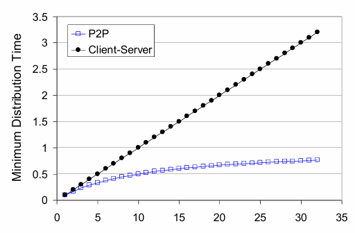

#### 结论

*   C/S模式分发效率受服务器带宽限制，节点越多耗时越长
*   P2P模式利用节点的上传能力分担服务器负载，节点数量越多分发效率越高，是具备**自扩展性**的文件分发方案

### 2.5.3BitTorrent：基于文件分发的P2P协议


#### 核**心术语**

**Torrent（洪流）**：参与一个特定文件分发的所有对等方的集合

**chunk（块）**：文件被划分成的等长文件块，典型长度为256KB

**tracker（追踪器）**：洪流的基础设施节点，用于跟踪参与洪流的对等方

**churn（扰动）**：节点可能随时上线或下线的特性

→一旦一个节点拥有整个文件，它会（自私的）离开或者保留在torrent中

#### **节点加入洪流的流程**

1.  初始状态：无任何文件块，后续通过其他节点累积文件块
2.  向追踪器注册自己，周期性通知追踪器自身在线状
3.  追踪器返回参与对等方的子集列表，节点与列表中的对等方建立并行TCP连接，形成邻近对等方
4.  邻近对等方随时间动态变化（部分节点离开、新节点接入）

#### 文件块请求机制（Requesting chunks）

*   任意时间，不同节点仅拥有文件块的子集，且子集各不相同

*   节点周期性向邻近对等方询问其持有的块列表

*   向对等节点请求它希 望的块，采用<u>最稀缺优先</u>（rarest first）策略

    *   优先请求邻居中副本数量最少的块，均衡各块在洪流中的副本数量，加速分发

#### 文件块发送机制：一报还一报（tit-for-tat）

*   向4个对等方发送块，这些块向 Alice提供最大带宽的服务

    *   节点持续测量每个邻居向自己发送数据的速率，每10秒重新评估

    *   <u>疏通（unchoked）</u>：选择速率最高的4个对等方，向其发送块

    *   其余邻居被<u>阻塞（choked）</u>，无法获取数据

*   每30秒随机选择1个额外邻居（试探节点），向其发送块

    *   进行优化疏通
    *   优化疏通的作用：让新节点获得块，有机会成为高速率对等方，加入top4列表，实现对等方的动态优化
    *   ※能够得到更高的上载速率： 发现更好的交换 伙伴，获得更快的文件传输速率!
    *   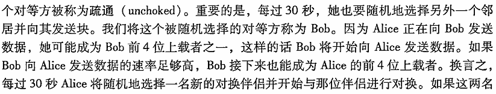

**tit-for-tat完整流程示例（Alice与Bob）**

1.  Alice优化疏通Bob，向其发送块
2.  Alice成为Bob的前4位数据提供者，Bob向Alice发送块作为答谢
3.  Bob的发送速率足够高，成为Alice的前4位数据提供者，双方持续对等交换

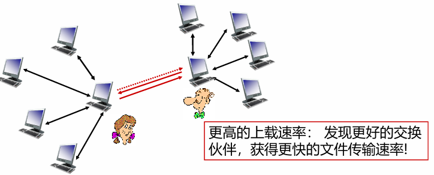

**补充扩展**

*   BitTorrent的激励机制为一报还一报，可被回避，但仍实现了广泛成功
*   分布式散列表（DHT）是另一种P2P应用，数据库记录分布在多个对等方上，在BitTorrent中得到广泛实现

## 2.6视频分发和内容分发网络

### 2.6.1因特网视频的基本概念

#### 视频流化服务与CDN核心背景

**视频流量**：占据互联网大部分带宽，Netflix、YouTube、Amazon Prime占据住宅ISP流量的80%（2020年数据）

**视频流化服务的核心挑战**

*   规模性：如何服务巨量用户

*   异构性：不同用户能力不同

    *   有线/移动接入
    *   带宽充足/受限用户

**解决方案**：分布式、应用层的基础设施（核心为CDN）

#### 多媒体：视频基础特性

**视频定义**：固定速度显示的图像序列，例如24张/秒

**网络视频特点**：像素的阵列，每个像素由若干比特表示

**编码（coding）**：利用图像内和图像间的冗余降低编码比特数

*   空间冗余（图像内）：例如相同颜色区域仅发送颜色值+重复个数，无需逐像素发送
*   时间冗余（相邻图像间）：仅发送相邻帧的帧差部分，无需发送完整帧
*   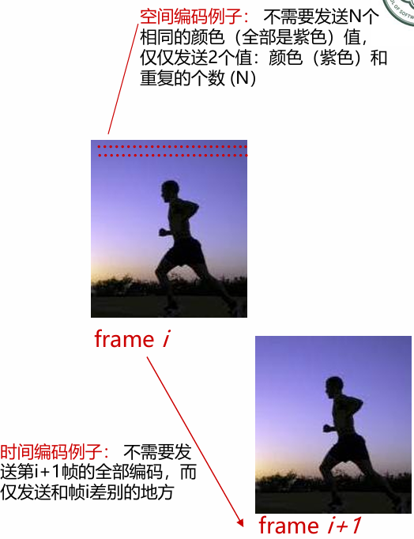

比特率特性：压缩视频比特率范围覆盖低质量100kbps、高清电影超4Mbps、4K在线播放超10Mbps；可生成同一视频的多版本（不同质量等级），适配不同带宽用户

#### 流式存储视频（Streaming stored video）的挑战

*   服务器定期向客户端发送大致定量的多媒体数据

*   **连续播放约束（continuous playout constraint）**：客户端视频播放时，播放时间必须匹配原始时间

    *   网络延迟可变（抖动），需客户端缓冲区匹配连续播放约束
    *   视频包可能丢失，需重传机制

*   更复杂的需求

    *   客户端交互：快进、快退、倍速播放、视频跳转

### 2.6.2流式多媒体技术DASH

#### DASH核心定义

基于HTTP的动态自适应流式技术（Dynamic Adaptive Streaming over HTTP），是HTTP流的新型研发方案，允许客户端根据网络状况自适应选择视频版本

**原因**

*   HTTP流：所有客户接收相同编码的视频，无法适配不同带宽、不同时段的网络差异

#### DASH客户端核心流程

1.  获取告示文件（manifest file）

    *   该文件为每个视频版本提供URL及其比特率

2.  客户端查询告示文件，在任意时刻通过HTTP GET请求指定字节范围，一次请求一个视频块

    *   带宽充足时，选择<u>最大码率</u>的视频块

    *   会话中不同时刻可根据当前可用带宽，<u>动态切换</u>请求不同编码速率的视频块

    *   缓存不足且带宽低时选低速率版本

    *   缓存充足且带宽高时选高速率版本

#### DASH客户端的“智能”决策

*   何时请求块

    *   通过缓存状态决定
    *   避免缓存“挨饿”或溢出，保障连续播放

*   请求什么编码速率的视频块

    *   带宽充足时请求高质量高比特率块

*   从哪里请求块

    *   可选择就近的服务器
    *   或高可用高带宽的服务器

#### 核心公式与构成

Streaming video = encoding + DASH + playout buffering

编码+dash+播放缓冲区

播放缓冲区用于匹配网络抖动，保障连续播放

### 2.6.3内容分发网（CDN，Content distribution networks）

#### 定义

*   管理分布在多个地理位置的服务器
*   在服务器中存储视频/网页/图片等内容的多个副本
*   将用户请求定向到体验最优的CDN节点
*   解决百万级用户同时流化视频的挑战

#### 需要CDN的原因

**方案1：单个超级服务中心（mega-server）**

*   缺点

    *   服务器到客户端跳数多，瓶颈链路带宽小导致卡顿
    *   “二八规律”导致同一视频多拷贝冗余，带宽浪费、成本高
    *   单点故障、性能瓶颈
    *   周边网络拥塞

*   特点：实现简单，但不可扩展

**方案2：CDN全网部署缓存节点，就近服务**

*   enter deep（深入式部署，Akamai首创）

    *   将CDN服务器深入到大量接入网

    *   更贴近用户，节点数量多

    *   Akamai在120+国家部署24万台服务器

    *   <u>缺点</u>：管理难度高

*   bring home（邀请做客式部署，Limelight采用）

    *   部署在少数（10个左右）关键位置（如互联网交换点IXP，靠近一级ISP）

    *   用租用线路连接服务器簇

    *   <u>优点</u>：维护管理开销低

    *   <u>缺点</u>：用户时延更高、吞吐量更低

#### CDN 核心工作逻辑

*   在CDN节点中存储内容的多个副本

*   用户从CDN请求内容时

    *   被重定向到最近的副本获取内容
    *   若网络路径拥塞，可选择其他副本

*   采用拉策略：未存储视频的集群收到请求时，从中心仓库/其他集群检索视频，流式传输同时本地缓存，删除不常用视频

#### CDN 访问流程（以NetCinema+KingCDN为例）

1.  Bob（客户端）访问netcinema.com网页，获取视频URL http\://netcinema.com/6Y7B23V
2.  Bob点击链接，向本地DNS服务器发送该URL的DNS请求
3.  本地DNS将请求中继到netcinema的权威DNS服务器，服务器返回KingCDN域名的CNAME（如：a1105.kingcdn.com）
4.  本地DNS向KingCDN的权威DNS发送请求，KingCDN返回最优CDN内容服务器的IP地址
5.  本地DNS将IP地址转发给Bob的主机
6.  Bob的主机与该CDN服务器建立TCP连接，发送HTTP GET请求；若使用DASH，服务器返回告示文件，客户端动态选择不同码率的视频块

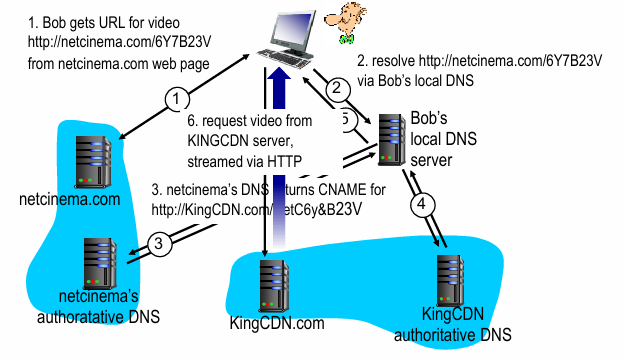

#### 集群选择策略

*   **地理邻近策略**：将用户定向到地理位置最近的集群，用商用地理数据库映射LDNS IP

    *   缺点：地理最近≠网络路径最近，LDNS 位置可能远离真实用户

*   **实时测量策略**：周期性测量各集群与用户LDNS的时延、丢包性能，选择最优集群

    *   缺点：部分LDNS不响应探测

**CDN分类**

*   **专用CDN（private CDN）**：内容提供商自有，如谷歌CDN，分发自有内容
*   **第三方CDN（third-party CDN）**：代表多个内容提供商分发内容，如Akamai、Limelight、Level-3

### 2.6.4实际案例

*   **Netflix**：亚马逊云存储多版本视频，上传到CDN服务器；用户请求后，CDN返回对应视频的告示文件，DASH服务器选择适配节点，开始流化
*   **Bilibili**：多层CDN架构，源站层（自建数据中心、对象存储、直播源）→多云CDN调度层（腾讯云、阿里云、华为云、Akamai等）→端侧补充层（P2P CDN、MCDN、自建边缘节点）→用户接入层（DNS智能解析，就近节点）；部分PCDN节点质量参差不齐，可通过修改Hosts切换优质CDN节点
